# OSeria 项目技术说明（总览版）

> 版本：v0.1 stable  
> 日期：2026-03-12  
> 用途：黑客松交付物、团队内部对账文档、Runtime 设计输入  
> 方法：代码优先；当 spec、日志与实现冲突时，以 `Architect/` 当前代码为准

## 1. 文档定位

本文档描述的是整个 OSeria 项目的当前技术边界，而不是理想态产品宣言。

OSeria 被定义为一个两段式系统：

1. `Architect`
   负责访谈、收敛体验信号、编译世界蓝图，并输出供后续系统使用的 `system_prompt`。
2. `Runtime`
   负责承接 `system_prompt` 进入持续互动小说 / SillyTavern 式运行。

当前仓库中真正落地的主要是 `Architect`。  
`Runtime` 目前没有独立代码实现，因此本文档对两段系统的书写深度不同：

- `Architect`：写到实现级别
- `Runtime`：只写职责、接口边界、待定义事项

## 2. 对账结论

截至 2026-03-12，`Architect/docs/OSeria_technical_overview.md` 的旧版 Architect 描述已落后于当前代码和最新实施计划，主要问题有四类：

1. 混入了部分旧 spec 口径
   例如把前端结果层写成不存在的 `BlueprintView` 组件，但当前实现实际是 `CompleteView + PromptInspector`。
2. 部分设计决策被写得过于完成态
   例如 `Runtime` 的启动输入、长期记忆和运行容器仍未在代码中定义，不应写成既成接口。
3. 当前已落地的新能力没有被写进来
   例如显式维度 registry、deterministic bubble 生成、repair pass、422 统一错误包装和前端错误三分视图。
4. 代码事实缺少足够约束
   例如后端只有 4 个 `BackendPhase`，前端另外维护 7 个 `UiPhase`；这是实际契约的一部分，必须明确写出。

本次修订目标是把文档收口到“可作为黑客松交付物的 v0.1 稳定版”。

## 3. 系统全景

```mermaid
flowchart LR
    U["User"] --> FE["Architect Frontend<br/>React + Vite"]
    FE --> API["Architect API / Service<br/>FastAPI + Session"]
    API --> IR["Interviewer Runtime"]
    IR --> ART["InterviewArtifacts"]
    ART --> C["Conductor"]
    C --> F["Forge"]
    F --> A["Assembler"]
    A --> PKG["ResultPackager"]
    PKG --> OUT["BlueprintSummary + system_prompt"]
    OUT -. handoff boundary .-> RT["Runtime (planned, not implemented)"]
```

当前代码证明成立的是一条完整的 `Architect` 编译链：  
`Interviewer -> Conductor -> Forge -> Assembler -> ResultPackager`

`Runtime` 目前只存在产品与架构层定义，不存在仓库内可执行实现。

## 4. 当前实现范围

### 4.1 状态划分

| 范围 | 状态 | 说明 |
| --- | --- | --- |
| Architect 后端主链路 | 已实现 | 代码存在且测试覆盖 |
| FastAPI API 层 | 已实现 | `/api/interview/start`、`/api/interview/message`、`/api/generate`、`/api/health` |
| Session 管理 | 已实现 | 当前为内存态 `InMemorySessionStore` |
| React 前端骨架 | 已实现 | 单页访谈流可运行，可构建 |
| BlueprintSummary 打包 | 已实现 | 启发式摘要，不是额外一次完整世界生成 |
| Runtime 独立运行时 | 未实现 | 当前仓库无代码 |
| 跨阶段长期记忆 / 世界状态循环 | 未实现 | 仍是 Runtime 议题 |
| Architect -> Runtime 正式接线协议 | 部分定义 | 当前只有 `system_prompt` 与蓝图产物，未形成完整运行时启动协议 |

### 4.2 本次核验结果

- 后端测试：`23/23` 通过
- 前端构建：`npm run build` 通过
- 前端测试：`3/3` 通过

这意味着当前 `Architect` 已达到“可演示的 MVP 编译器”状态，但不等于 Runtime 已成立。

## 5. Architect：当前基线与升级方向

### 5.0 当前基线与 vNext 目标的区别

当前代码已经成立的是一条可运行的世界编译链：

`Interviewer Runtime -> InterviewArtifacts -> Conductor -> Forge -> Assembler -> ResultPackager`

但最新实施计划已经把下一阶段 Architect 的正式目标收口为三层：

1. `State Layer`
   - `routing_snapshot`
   - `world_dossier`
   - `player_dossier`
2. `Compile Layer`
   - `CompileOutput`
   - `FrozenCompilePackage`
3. `Delivery Layer`
   - `blueprint`
   - `system_prompt`

必须明确：

- 以上三层模型是 Architect 的下一阶段正式升级方向
- 当前代码里只有 `routing_snapshot` 长期存在
- `world_dossier / player_dossier / CompileOutput / FrozenCompilePackage` 仍未接入运行时主链路
- 总览文档必须同时写清“当前基线”和“下一阶段架构”，不能把两者混成已实现

### 5.1 Layer 0: Interviewer Runtime

对应文件：

- `interviewer.py`
- `interview_controller.py`
- `dimension_registry.py`
- `bubble_suggester.py`
- `prompts/interviewer_system_prompt.md`

实际职责：

1. 用固定开场问题启动访谈
2. 从 `data/interview_dimensions.json` 加载显式维度 registry，并把维度菜单注入访谈 prompt
3. 在 `INTERVIEWING` 阶段调用 LLM 生成“用户可见文本 + 系统 JSON”
4. 解析 `routing_snapshot`
5. 当模型偶发漏掉系统 JSON 时，优先在后端内部执行 repair pass
6. 对 `suggested_tags` 做后端归一化，当前由 `BubbleSuggester` 生成用户可点的中文短句
7. 由 `InterviewController` 判定何时从访谈切到 `MIRROR`
8. 处理 `MIRROR -> LANDING -> COMPLETE` 状态流转
9. 在 `COMPLETE` 阶段输出最终访谈交付物

代码级事实：

- 后端状态枚举只有 4 个：`interviewing / mirror / landing / complete`
- `Mirror` 触发条件由代码判定，而不是由 prompt 自主决定：
  - `untouched <= 2`
  - 或 `turn >= 6`
- `Mirror` 确认后进入 `Landing`
- `Landing` 用户回答后，运行时输出最终 `InterviewArtifacts`
- 体验维度已经从纯 prompt 内隐菜单升级为显式 registry，并由代码做覆盖校验
- 当前泡泡已不再直接信任模型原始 `suggested_tags`，而是由后端做 deterministic 归一化生成

### 5.2 显式维度 registry、steering 和泡泡生成

对应文件：

- `dimension_registry.py`
- `data/interview_dimensions.json`
- `bubble_suggester.py`

当前实现已经收口出一套显式访谈维度系统：

1. `InterviewDimensionRegistry` 从 `data/interview_dimensions.json` 加载维度定义
2. 维度菜单会被注入 `interviewer_system_prompt.md`
3. steering 的维度排序不再完全依赖静态列表，而是使用 registry 中的优先级元数据
4. `BubbleSuggester` 基于问题文本、`routing_snapshot` 和维度 phrase bank 生成用户可点击泡泡

这意味着当前系统已经不再是“prompt 里写几个标签，前端直接照抄模型 suggested_tags”的状态。

### 5.3 repair pass 已进入主链路

当前访谈不是完全依赖一次模型响应成功解析。  
`Interviewer` 现在具备一层内部 repair 机制：

- 先尝试正常解析 tagged blocks
- 如果缺失系统 JSON 或格式异常，则触发一次结构化 repair
- 首次 repair 失败后，再进行一次更严格的 repair

这层的意义是：

- 避免模型偶发格式失真直接打断主流程
- 让 Architect 访谈运行时在竞速模型下更稳
- 但 repair 的观测、告警和质量统计仍未收口

### 5.4 轻量 steering 已接入

- 上一轮 `routing_snapshot`
- 最新用户输入是否为低信号短答
- `Mirror` 被拒绝后是否需要切新角度
- 哪些维度已经被 `excluded`

这部分已实现，但它的边界需要说清：

- 它只影响“下一问优先朝哪里偏”
- 它不直接硬编码问题文本
- “双轨竞速机制”等更重的实时预生成方案仍停留在 `New_LOG.MD` 的设计层，当前代码未实现

### 5.5 InterviewArtifacts 是当前生成阶段正式输入

运行时最终交付的结构，在代码中等价为：

- `confirmed_dimensions`
- `emergent_dimensions`
- `excluded_dimensions`
- `narrative_briefing`
- `player_profile`

内部实现中，`Interviewer` 先维护 `routing_tags`，API 层再序列化为上述字段。  
这组字段是 `Architect` 编译链的正式输入，不是展示文案。

但从下一阶段架构看，需要额外说明：

- 当前代码中的 `InterviewArtifacts` 仍是现行实现名称
- vNext 计划中，这个“最小稳定语义摘要”会统一收口为 `CompileOutput`
- `CompileOutput` 仍是计划中概念，当前代码尚未替换现有 `InterviewArtifacts`

### 5.6 Layer 1: Conductor

对应文件：

- `conductor.py`
- `data/dimension_map.json`

实际职责：

1. 接收访谈产物
2. 将 `confirmed_dimensions` 映射到 Pack
3. 处理 `requires` 和 `also_consider`
4. 对未知维度保留任务，但 `pack_id = None`
5. 输出 `ForgeManifest`

代码级事实：

- `Conductor` 不是另一次 LLM 推理层，当前主要是代码路由
- 未命中 `dimension_map.json` 的维度不会被丢弃，而是进入“无模板 Pack”的 Forge 任务
- `supplementary_packs` 已在 `ForgeTask` 中存在，说明当前实现支持主 Pack 之外的补充上下文
- 按 vNext 计划，`Conductor` 后续仍只消费 `CompileOutput`，不直接消费 live dossier

### 5.7 Layer 2: Forge

对应文件：

- `forge.py`
- `prompts/subagent_system_prompt.md`

实际职责：

1. 为每个维度任务渲染一份子代理 prompt
2. 使用 `asyncio.gather()` 并发生成规则片段
3. 当维度没有现成模板时，使用明确的 fallback 指令要求从零生成

代码级事实：

- Forge 的输入单位是 `ForgeTask`
- 输出是 `dict[dimension, forged_rule_text]`
- 每个模块结果会被包装为 Markdown 小节，例如 `### [dim:social_friction]`
- 按 vNext 计划，Forge 后续会改为消费 `FrozenCompilePackage.compile_output + forge_context`

### 5.8 Layer 3: Assembler

对应文件：

- `assembler.py`
- `data/core/*.json`

实际职责：

1. 固定加载 Core 模块
2. 从 `narrative_briefing + player_profile` 中提取 8 个 Core 变量
3. 替换 Core 模板中的占位符
4. 按固定章节顺序拼出完整 `system_prompt`

代码级事实：

- Core 变量提取不是硬编码字符串替换，而是一次轻量 `generate_json()` 调用
- 生成出的最终 Prompt 当前具有固定 7 段结构：
  - `I. System Role`
  - `II. Experience Standard`
  - `III. Immutable Constitution`
  - `IV. Engine Protocols`
  - `V. World-Specific Rules`
  - `VI. Emergent Dimensions`
  - `VII. Player Calibration`
- 按 vNext 计划，Assembler 后续会改为消费 `FrozenCompilePackage.compile_output + assembler_context`

### 5.9 ResultPackager

对应文件：

- `result_packager.py`

实际职责：

1. 把 `InterviewArtifacts + ForgeManifest + system_prompt` 转成前端结果页可读对象
2. 输出 `BlueprintSummary`

需要特别说明：

- `BlueprintSummary` 不是下游 Runtime 的规则源文件
- 它是产品展示层摘要
- 当前摘要生成主要是启发式文本提取，不是再次完整“造世界”
- 按 vNext 计划，交付层的长期方向是只读冻结后的编译结果，不再各自重复“再理解”一次用户

### 5.10 Architect 的下一阶段正式升级方向

基于最新实施计划，Architect 的下一轮升级目标已经明确，不再属于模糊愿景：

1. `Call 1: DossierUpdater`
   - 负责逐轮更新 `world_dossier + player_dossier`
2. `Call 2: InterviewComposer`
   - 负责自然语言问题 / Mirror 文本
3. `Call 3: BubbleComposer`
   - 负责生成真正贴合当前用户心智的 `bubble_candidates`

这三次调用的目标分工已经定稿，但当前状态仍是：

- 相关 prompt 文件已存在
  - `prompts/dossier_updater_system_prompt.md`
  - `prompts/interview_composer_system_prompt.md`
  - `prompts/bubble_composer_system_prompt.md`
  - `prompts/compile_output_system_prompt.md`
- 运行时主链路尚未切换到这套三调用模型
- `world_dossier / player_dossier / CompileOutput / FrozenCompilePackage` 仍未进入 session 正式状态

## 6. API 与前后端契约

### 6.1 当前 API

对应文件：

- `api.py`
- `api_models.py`
- `service.py`

已落地端点：

- `POST /api/interview/start`
- `POST /api/interview/message`
- `POST /api/generate`
- `GET /api/health`

### 6.2 关键请求/响应边界

`/api/interview/start`

- 返回 `session_id`
- 返回 `phase = interviewing`
- 返回固定开场问题

`/api/interview/message`

- 请求体支持 `message`
- 也支持结构化 `mirror_action: "confirm" | "reconsider"`
- `mirror_action` 由 service 层转换为运行时可识别输入

`/api/generate`

- 输入为 `session_id`
- 可显式附带 `artifacts`
- 若不附带，则复用 session 中已保存的访谈产物

### 6.3 BackendPhase 与 UiPhase 不是同一套枚举

这是当前文档必须明确写出的实现事实：

- 后端 `BackendPhase`：`interviewing / mirror / landing / complete`
- 前端 `UiPhase`：`idle / q1 / interviewing / mirror / landing / generating / complete`

也就是说：

- `q1` 是前端对“后端刚启动、尚无 raw_payload 的 interviewing”做的本地映射
- `generating` 是前端本地等待态，不是后端 phase

### 6.4 当前错误契约边界

已实现部分：

- `ArchitectServiceError` 会被包装成 `ErrorResponse`
- 错误体有 `code / message / retryable`

当前已收口部分：

- FastAPI 自带的 422 validation error 已统一包装进 `ErrorResponse`
- 前端结果态已拆成成功 / 生成失败 / 致命故障三类视图

仍需继续推进：

- repair pass 的观测与统计
- 真正的 SSE 流式输出

## 7. 前端骨架：当前真实边界

前端位于 `frontend/`，技术栈为 `React 18 + TypeScript + Vite`。

当前代码已实现的页面状态：

- `q1`
- `interviewing`
- `mirror`
- `landing`
- `generating`
- `complete`

关键组件包括：

- `App.tsx`
- `CurrentScene.tsx`
- `BubbleField.tsx`
- `InputArea.tsx`
- `MirrorView.tsx`
- `LandingView.tsx`
- `GenerationView.tsx`
- `CompleteView.tsx`
- `CompleteSuccessView.tsx`
- `GenerateFailureView.tsx`
- `FatalErrorView.tsx`
- `PromptInspector.tsx`

需要修正文档口径的地方：

- 当前并不存在名为 `BlueprintView` 的组件
- 蓝图展示实际内嵌在 `CompleteView`
- 完整 Prompt 查看器是 `PromptInspector`

已实现的 UX 对齐点：

- 单页访谈流
- `Mirror` 的结构化动作接线
- 结果页双层展示：蓝图摘要 + 完整 Prompt 查看器

尚未实现或未验证的点：

- SSE 流式输出
- vNext 的 dossier / bubble / compile 新协议接线
- 更完整的产品化错误文案体系

## 8. 测试与可验证性

当前测试目录为 `Architect/tests/`，已覆盖以下主题：

- `test_interview_controller.py`
- `test_interviewer_steering.py`
- `test_conductor.py`
- `test_pipeline.py`
- `test_result_packager.py`
- `test_service_api.py`
- `test_interviewer_recovery.py`

这些测试证明的不是“产品完成”，而是以下事实已经成立：

1. 访谈状态机可流转
2. 显式维度 registry 已接入访谈 prompt 与 steering 排序
3. deterministic bubble 生成规则可运行
4. repair pass 能在模型格式失真时回补系统 JSON
5. 维度映射规则可运行
6. `Interviewer -> Conductor -> Forge -> Assembler` 可在 mock LLM 下走通
7. API/service 层已支持 `mirror_action`
8. 422 validation error 已统一包装
9. `BlueprintSummary` 打包逻辑已落地

前端当前已补上最小交互回归测试，验证：

1. Q1 冷启动可正常进入
2. Mirror confirm 能进入 Landing
3. Generate failure 能保留成果并重试成功

## 9. Runtime：当前只能写到哪里

### 9.1 已知事实

目前仓库内没有 `Runtime` 独立实现。  
因此，不能把以下内容写成既成事实：

- 长期记忆系统已经存在
- 世界状态循环已经存在
- SillyTavern 式会话容器已经存在
- Architect 与 Runtime 已经完成程序级接线

### 9.2 当前可确认的交接边界

从现有代码可确认的真实输出只有：

- `GenerateResponse.blueprint`
- `GenerateResponse.system_prompt`

其中：

- `blueprint` 面向人读
- `system_prompt` 面向下游运行时

除这两项外，Runtime 的启动协议仍未正式定义。  
例如首回合上下文、世界状态结构、记忆存储模型、事件循环接口，都不应在本文档里冒充成已经确定。

### 9.3 Runtime 的职责定义

在不超出证据的前提下，Runtime 目前只能被定义为：

1. 承接 `system_prompt`
2. 在后续交互中维持世界规则一致性
3. 管理叙事推进、关系变化、事件后果和状态积累
4. 提供互动小说 / ST 风格的持续运行体验

这是系统职责定义，不是代码完成声明。

## 10. 与现有 spec / 决策日志的关系

### 10.1 已被代码吸收的决策

以下方向已经能在实现中找到对应证据：

- `Mirror` 作为访谈收敛点
- `Landing` 放在 `Mirror` 之后
- `routing_snapshot` 作为访谈内部状态账本
- 显式体验维度 registry
- deterministic bubble 生成与 registry 驱动 steering
- repair pass 提升访谈解析稳健性
- 体验维度到 Pack 的路由机制
- Forge 并行子代理编译
- 结果页拆成蓝图摘要与完整 Prompt 查看

### 10.2 仍停留在 spec / 日志层的内容

以下内容仍应视为“设计目标”，不是“当前实现”：

- 双轨竞速机制
- twin dossier（`world_dossier + player_dossier`）长期状态
- `CompileOutput` / `FrozenCompilePackage` 冻结编译接口
- `DossierUpdater + InterviewComposer + BubbleComposer` 三调用运行时
- Runtime 的正式运行时协议
- 跨阶段持久化记忆与世界状态容器

## 11. 当前已知差距与风险

1. Session 目前仅为内存态
   服务重启后会话丢失，不适合作为长期产品形态。
2. Architect 仍只有 `routing_snapshot` 这一份长期状态
   世界理解和玩家理解尚未以 twin dossier 逐轮固化。
3. 当前 `InterviewArtifacts` 仍承担现行中间接口角色
   `CompileOutput / FrozenCompilePackage` 还没真正冻结编译语义。
4. repair pass 虽已接入，但观测、告警和质量统计还未收口。
5. 前端仍是骨架而非完整产品前端
   测试已补上最小回归，但交互质量和异常文案仍有继续打磨空间。
6. Runtime 尚未落地
   整个 OSeria 仍停在“两段式系统的前半段已经成立，后半段仍待实现”的阶段。

## 12. 下一阶段路线

建议按以下顺序推进：

1. 把 twin dossier 接入 session 和访谈运行时
2. 落地 `DossierUpdater + InterviewComposer + BubbleComposer` 三调用架构
3. 在 Landing 后生成并冻结 `CompileOutput / FrozenCompilePackage`
4. 让 `Conductor / Forge / Assembler / ResultPackager` 改为消费冻结编译包
5. 再定义 `Architect -> Runtime` 正式交接协议
6. 最后进入 Runtime 第一版实现

## 13. 总结

OSeria 当前已经证明了一件事：  
“世界构建”可以被做成一条可运行的编译链，而不是一段临时 Prompt。

但截至 2026-03-12，真正被代码证明成立的仍只有前半段：

- `Architect` 已是可运行、可测试、可演示的世界编译器
- 且正在从“单次访谈 + 一次性总结”升级到“State Layer -> Compile Layer -> Delivery Layer”的正式架构
- `Runtime` 仍是下阶段系统，不是当前仓库中的既成实现

这就是 v0.1 稳定版总览文档需要坚持的事实边界。
