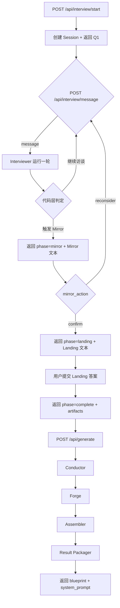

# OSeria Architect Engine — 后端实施规格书

基于 [New_LOG.MD](/Users/okfin3/project/architect-agent-prototype/Architect/docs/New_LOG.MD)、已定稿的访谈员提示词 [interviewer_system_prompt.md](/Users/okfin3/project/architect-agent-prototype/Architect/prompts/interviewer_system_prompt.md) 与当前 UI/UX 规格 [ui_ux_design_thinking_v2.md](/Users/okfin3/project/architect-agent-prototype/Architect/docs/ui_ux_design_thinking_v2.md)，在**已实现的运行时基础上**补齐可供前端接线的后端能力。

## 0. 技术栈约定 (Tech Stack)

### Backend (Architect Engine)
- **语言**: Python 3.10+
- **框架**: FastAPI + Uvicorn（本阶段为必须项，不再是“未来预留”）
- **核心依赖**:
  - `httpx` 或标准库兼容 HTTP 客户端（异步大模型 API 调用）
  - `fastapi`
  - `uvicorn`
  - `pydantic >= 2.0`（API schema / request validation）
  - 标准库 `asyncio`, `json`, `dataclasses`, `pathlib`, `uuid`
- **环境变量**: `.env` 存储大模型 API Keys

### Frontend (预留对接)
- **框架**: React 18 + Vite + TypeScript
- **样式**: Tailwind CSS + Framer Motion (动画)
- **状态**: React hooks

---

## 1. 系统架构全景
```
Layer -1: API / Session Layer
  │  输入：HTTP 请求（start / message / generate）
  │  输出：结构化 JSON 响应 / 统一错误响应
  │  职责：session_id、request validation、error mapping、generate retry boundary
  ↓
Layer 0: The Architect (Module-Aware Interviewer Agent Runtime)
  │  输入：Q1 固定静态 + 用户回答 + 体验维度罗盘
  │  输出：动态问题 + suggested_tags + routing_snapshot
  │  终止：代码层判定 (untouched ≤ 2 或 turn ≥ 6) → Mirror → Landing
  │  最终交付：3 个结构化 JSON（Tags / Briefing / Profile）
  ↓
Layer 1: The Conductor (最终 Routing 确认 + 维度→模块映射)
  │  输入：三大交付物 + dimension→pack 映射表
  │  输出：confirmed Pack IDs + emergent 标记 + Narrative Skeleton
  ↓
Layer 2: The Forge (并行 SubAgent 集群)
  │  每个 confirmed 维度 → 独立 SubAgent → 定制规则片段
  │  emergent 维度 → 不预写规则（运行时涌现）
  ↓
Layer 3: The Assembler (代码缝合)
  │  Meta(role+experience) + Constitution(3 Laws) + Engine(8 模块) + Forged Rules + Emergent 标注 + Player Profile
  │  → 最终 System Prompt
  ↓
Layer 4: Result Packaging
  │  输入：InterviewArtifacts + ForgeManifest + Final Prompt
  │  输出：BlueprintSummary + system_prompt
  │  职责：服务前端 BlueprintView / PromptInspector 双层结果页
```

---

## Proposed Changes

### Component 1: 数据层 (Data Layer)

#### [DONE] [data/core/](file:///d:/Adoc/Architect-Prototype/architect-agent-prototype/Architect/data/core/) — 13 个核心模块 JSON（强制加载）
已从源 JSON 拆分为一模块一文件。分为 3 个层级：

**Meta 层（2 个，最高优先级）：**
| 文件 | 模块 ID | 职责 |
|---|---|---|
| [meta.role.json](file:///d:/Adoc/Architect-Prototype/architect-agent-prototype/Architect/data/core/meta.role.json) | core.meta.role | 叙事系统角色定义（第二人称 / 时间戳 / 不代替主角）|
| [meta.experience.json](file:///d:/Adoc/Architect-Prototype/architect-agent-prototype/Architect/data/core/meta.experience.json) | core.meta.experience | 预期体验标准（写作质感 / 基调变量 / 质量红线）|

**Constitution 层（3 个，不可覆写天条）：**
| 文件 | 模块 ID | 职责 |
|---|---|---|
| [constitution.json](file:///d:/Adoc/Architect-Prototype/architect-agent-prototype/Architect/data/core/constitution.json) | core.constitution | 三大天条合集（兼容旧格式）|
| [constitution.law1.json](file:///d:/Adoc/Architect-Prototype/architect-agent-prototype/Architect/data/core/constitution.law1.json) | core.constitution.law1 | Law 1: Simulation First |
| [constitution.law2.json](file:///d:/Adoc/Architect-Prototype/architect-agent-prototype/Architect/data/core/constitution.law2.json) | core.constitution.law2 | Law 2: World Emergence |
| [constitution.law3.json](file:///d:/Adoc/Architect-Prototype/architect-agent-prototype/Architect/data/core/constitution.law3.json) | core.constitution.law3 | Law 3: Diegetic Interface |

**Engine 层（8 个，核心引擎协议）：**
| 文件 | 模块 ID | 职责 |
|---|---|---|
| [eng.sensory.json](file:///d:/Adoc/Architect-Prototype/architect-agent-prototype/Architect/data/core/eng.sensory.json) | core.eng.sensory | 感官三角 |
| [eng.physics.json](file:///d:/Adoc/Architect-Prototype/architect-agent-prototype/Architect/data/core/eng.physics.json) | core.eng.physics | 社会物理学 (Protocol H/V) |
| [eng.casting.json](file:///d:/Adoc/Architect-Prototype/architect-agent-prototype/Architect/data/core/eng.casting.json) | core.eng.casting | 选角导演 (3-Layer NPC) |
| [eng.entropy.json](file:///d:/Adoc/Architect-Prototype/architect-agent-prototype/Architect/data/core/eng.entropy.json) | core.eng.entropy | 现实热力学 (关系冷却) |
| [eng.pacing.json](file:///d:/Adoc/Architect-Prototype/architect-agent-prototype/Architect/data/core/eng.pacing.json) | core.eng.pacing | 节奏导演 (正弦波) |
| [eng.subtext.json](file:///d:/Adoc/Architect-Prototype/architect-agent-prototype/Architect/data/core/eng.subtext.json) | core.eng.subtext | 潜台词界面 (Zero UI) |
| [eng.veil.json](file:///d:/Adoc/Architect-Prototype/architect-agent-prototype/Architect/data/core/eng.veil.json) | core.eng.veil | 幕纱协议 (NPC 认知防火墙) |
| [eng.archivist.json](file:///d:/Adoc/Architect-Prototype/architect-agent-prototype/Architect/data/core/eng.archivist.json) | core.eng.archivist | 沉默档案员 |

#### [DONE] [data/packs/](file:///d:/Adoc/Architect-Prototype/architect-agent-prototype/Architect/data/packs/) — 13 个 Pack 模块 JSON（按需加载）
已拆分为一模块一文件，Forge SubAgent 可直接读取整个文件作为 Context。

#### [NEW] [dimension_map.json](file:///d:/Adoc/Architect-Prototype/architect-agent-prototype/Architect/data/dimension_map.json)
体验维度 → Pack 模块的映射表（决策 10.1）。这是 Tag Abstraction Layer 的核心：

```json
{
  "dim:social_friction": {
    "primary": "pack.urban.friction",
    "also_consider": ["pack.strategy.friction"],
    "fallback_context": "社交碰撞与地位差异"
  },
  "dim:ability_loot": {
    "primary": "pack.power.plugin.loot",
    "requires": ["pack.power.interface"],
    "also_consider": [],
    "fallback_context": "能力拷贝与高风险博弈"
  }
}
```

**映射规则（决策 13）**：
- `primary`：主 Pack，无条件加载为 SubAgent 的 Few-shot 参考
- `requires`：硬依赖，无条件追加加载（例：`ability_loot` 依赖 `power.interface` 的 Hunter's Eye）
- `also_consider`：软依赖，仅当对应的 Pack 未作为其他维度的 primary 被单独处理时才追加加载（避免重复）

> [!IMPORTANT]
> 当 LLM 自建新维度标签（如 `dim:craft_economy`）时，`dimension_map` 中无对应 Pack。此时 SubAgent 进入"完全自由创作"模式，不引用任何 Few-shot，纯粹基于 Narrative Briefing 生成。

---

### Component 2: 提示词层 (Prompts Layer)

#### [DONE] [interviewer_system_prompt.md](file:///d:/Adoc/Architect-Prototype/architect-agent-prototype/Architect/prompts/interviewer_system_prompt.md)
已完成。包含：
- Empathic Reflector 人格定义（Identity 驱动，非 Rule 驱动）
- 体验维度罗盘（13 已知 + 自建新标签授权）
- 同频法则 / AI 补位 / 有机探索 / 只碰一次
- 每轮输出格式（question + suggested_tags + routing_snapshot + vibe_flavor）
- The Mirror（鸡皮疙瘩级质量标准）
- The Landing（波峰→波谷性别问题）
- 三大交付物 JSON 结构（Tags / Briefing / Profile）
- 留白与涌现（emergent 维度机制）

#### [NEW] [subagent_system_prompt.md](file:///d:/Adoc/Architect-Prototype/architect-agent-prototype/Architect/prompts/subagent_system_prompt.md)
Forge SubAgent 的统一 System Prompt 模板：
```
你是 OSeria 世界引擎的 [{module_name}] 规则定制师。
你的任务是根据玩家的内心渴望，参考下方的规则模板，为他的世界定制一份专属的 [{module_name}] 规则。

【玩家的世界简报】：
{narrative_briefing}

【玩家侧写】：
{player_profile}

【参考规则模板】（你不需要全盘照抄，但需要保持相同的规则深度和精度）：
{pack_content}

请输出定制后的 [{module_name}] 规则段落。
```

> [!NOTE]
> 当维度没有对应 Pack（LLM 自建标签）时，`{pack_content}` 为空，替换为：
> "此维度没有现成的规则模板。请根据玩家的世界简报和侧写，从零创建一套规则。"

---

### Component 3: 核心运行时 (Runtime Engine)

#### [DONE] [interview_controller.py](/Users/okfin3/project/architect-agent-prototype/Architect/interview_controller.py)
已完成。状态机：`INTERVIEWING → MIRROR → LANDING → COMPLETE`

关键逻辑：
- Mirror 触发由代码层判定：`untouched ≤ 2` 或 `turn ≥ 6`（可调参数）
- 每阶段注入不同的系统指令给 LLM
- [finalize_routing()](file:///d:/Adoc/Architect-Prototype/architect-agent-prototype/Architect/interview_controller.py#132-151) 将 `untouched` → `emergent`

#### [DONE, API层需适配] [interviewer.py](/Users/okfin3/project/architect-agent-prototype/Architect/interviewer.py)
访谈代理主循环已可工作。当前是**运行时核心**，不是最终 API 边界。职责：

1. 加载 [interviewer_system_prompt.md](file:///d:/Adoc/Architect-Prototype/architect-agent-prototype/Architect/prompts/interviewer_system_prompt.md) 作为 System Prompt
2. 发送 Q1（固定静态，零延迟）
3. 循环：接收用户回答 → 调用 LLM → 解析 JSON 输出 → 提取 `routing_snapshot` 交给 [InterviewController](file:///d:/Adoc/Architect-Prototype/architect-agent-prototype/Architect/interview_controller.py#29-151)
4. 当 Controller 返回 `MIRROR` → 注入系统指令要求 LLM 生成 Mirror
5. 当 Controller 返回 `LANDING` → 注入系统指令要求 LLM 问性别
6. 当 Controller 返回 `COMPLETE` → 注入系统指令要求 LLM 输出三大交付物 JSON
7. 解析最终 JSON，调用 `controller.finalize_routing()` 将 untouched 转 emergent

**必须补齐的 API 适配点：**
- 现有 `process_user_message(user_message: str)` 只接受纯文本输入
- 前端规范要求 Mirror 阶段优先走结构化字段 `mirror_action: 'confirm' | 'reconsider'`
- 因此 API 层必须负责：
  - `mirror_action='confirm'` → 转换为运行时可识别输入
  - `mirror_action='reconsider'` → 转换为运行时可识别输入
  - 兼容旧字符串 fallback（`推门` / `重来`）

**LLM 调用规格**：
- 模型：`deepseek-chat` 或 `qwen-max`（极速直出，非 Reasoning）
- 温度：0.7-0.8（需要创意但不能跑偏）
- 每轮输出格式解析：split 出用户可见文本和系统侧 JSON

#### [DONE] [conductor.py](/Users/okfin3/project/architect-agent-prototype/Architect/conductor.py)
Layer 1 Conductor。职责：

1. 接收访谈三大交付物
2. 读取 [dimension_map.json](file:///d:/Adoc/Architect-Prototype/architect-agent-prototype/Architect/data/dimension_map.json)
3. 将 `confirmed_dimensions` 映射为具体 Pack IDs
4. 对于 LLM 自建的新维度标签（不在 map 中），标记为 `no_pack`
5. `emergent_dimensions` 不参与 Forge，仅传递给 Assembler 做标注
6. 输出 [ForgeManifest](file:///d:/Adoc/Architect-Prototype/architect-agent-prototype/Architect/conductor.py#27-34)：

```python
@dataclass
class ForgeTask:
    dimension: str          # e.g. "dim:combat_rules"
    pack_id: str | None     # e.g. "pack.power.conflict" 或 None
    pack_content: str       # Pack JSON 的完整文本，或空字符串
    narrative_briefing: str
    player_profile: str

@dataclass
class ForgeManifest:
    tasks: list[ForgeTask]
    emergent_dimensions: list[str]
    excluded_dimensions: list[str]
    player_profile: str
```

#### [DONE] [forge.py](/Users/okfin3/project/architect-agent-prototype/Architect/forge.py)
Layer 2 Forge 负责并发调用大模型定制各 Pack 规则。
当前已满足：
1. 输入为 `ForgeManifest`
2. 使用 `asyncio.gather` 并发
3. 通过统一 `llm_client` 发起调用
4. 使用 `subagent_system_prompt.md` 模板渲染上下文

#### [DONE, 需补结果摘要层] [assembler.py](/Users/okfin3/project/architect-agent-prototype/Architect/assembler.py)
Layer 3 Assembler 已可输出完整 System Prompt 字符串。

**难点突破（Core 变量的零幻觉替换）：**
Core 模块（如 `meta.experience`, `eng.sensory`）内部藏有 `{{ tone_primary }}` 等 8 个模板变量。由于 Core 不经过 Forge，Assembler 需要通过一次**极速轻量的结构化 LLM 调用**，从 Narrative Briefing 中提取这些变量，然后用纯 Python `str.replace()` 进行物理替换，坚决防止大模型篡改 Core 底层逻辑。

**核心逻辑与代码规约：**
```python
class Assembler:
    def __init__(self, data_dir: str, llm_client):
        self.data_dir = data_dir
        self.llm = llm_client

    async def _extract_core_variables(self, briefing: str, profile: str) -> dict:
        """从简报中结构化提取 Core 所需的变量填充"""
        prompt = f'''基于以下世界简报和玩家侧写，提取 8 个关键设定变量返回JSON：
简报：{briefing}
侧写：{profile}
必需字段：tone_primary(主基调), tone_secondary(副基调), content_ceiling(尺度上限,例R18/PG13), humor_density(幽默密度), sensory_smell_example(气味范例), sensory_sound_example(声音范例), tone_filter(氛围滤镜), ignorance_reaction(对未知的反应)。'''
        return await self.llm.generate_json(prompt)

    def _load_and_fill_core(self, relative_path: str, variables: dict) -> str:
        """加载 Core 并进行物理正则/字符串替换"""
        raw_content = load_file(self.data_dir / "core" / relative_path)
        for k, v in variables.items():
            raw_content = raw_content.replace(f"{{{{ {k} }}}}", str(v))
        return raw_content

    async def assemble(self, forged_results: dict[str, str], manifest: ForgeManifest) -> str:
        # 1. 提取变量
        vars = await self._extract_core_variables(manifest.narrative_briefing, manifest.player_profile)
        
        # 2. 按优先级死板拼接
        output = []
        output.append("# OSeria System Prompt — [定制世界]")
        
        output.append("## I. System Role (你是谁)")
        output.append(self._load_and_fill_core("meta.role.json", vars))
        
        output.append("## II. Experience Standard (写作质感)")
        output.append(self._load_and_fill_core("meta.experience.json", vars))
        
        output.append("## III. Immutable Constitution (天条)")
        for law in ["constitution.law1.json", "constitution.law2.json", "constitution.law3.json"]:
            output.append(self._load_and_fill_core(law, vars))
            
        output.append("## IV. Engine Protocols (引擎中间件)")
        for eng in ["eng.sensory.json", "eng.physics.json", "eng.casting.json", "eng.entropy.json", "eng.pacing.json", "eng.subtext.json", "eng.veil.json", "eng.archivist.json"]:
            output.append(self._load_and_fill_core(eng, vars))
            
        output.append("## V. World-Specific Rules (Forged — 定制规则)")
        for text in forged_results.values():
            output.append(text)
            
        output.append("## VI. Emergent Dimensions (留白涌现)")
        output.append("以下维度未预写规则，由运行时 NPC/事件引擎自然涌现：")
        for dim in manifest.emergent_dimensions:
            output.append(f"- {dim}")
            
        output.append("## VII. Player Calibration (玩家校准)")
        output.append(manifest.player_profile)
        
        return "\n\n".join(output)
```

#### [DONE] [llm_client.py](/Users/okfin3/project/architect-agent-prototype/Architect/llm_client.py)
统一的 LLM 调用客户端：
- 封装 OpenAI 兼容 chat completion 调用
- 支持 DeepSeek / Qwen / OpenAI 兼容接口
- 统一错误处理和重试
- 从 `.env` 读取 API Key

#### [DONE, 仅开发入口] [main.py](/Users/okfin3/project/architect-agent-prototype/Architect/main.py)
当前入口文件用于 CLI 验证，不是最终前后端接线入口。当前职责：
```
1. Interviewer 运行访谈
2. 获取三大交付物
3. Conductor 映射维度→Pack
4. Forge 并行生成
5. Assembler 缝合
6. 输出最终 System Prompt
```

---

### Component 4: API / Session 适配层 (Backend-for-Frontend Layer)

这是当前后端计划中**新增且必须优先实现**的部分。原因很简单：运行时已经存在，但前端 spec 依赖的 HTTP/session/error/result contract 目前不存在。

#### [NEW] `api_models.py`
使用 Pydantic 定义 API schema，至少包括：

```python
class BackendPhase(str, Enum):
    interviewing = "interviewing"
    mirror = "mirror"
    landing = "landing"
    complete = "complete"


class StartInterviewResponse(BaseModel):
    session_id: str
    phase: BackendPhase
    message: str
    raw_payload: dict | None = None


class InterviewMessageRequest(BaseModel):
    session_id: str
    message: str | None = None
    mirror_action: Literal["confirm", "reconsider"] | None = None

    @model_validator(mode="after")
    def validate_shape(self):
        ...


class GenerateRequest(BaseModel):
    session_id: str
    artifacts: InterviewArtifactsModel


class BlueprintSummary(BaseModel):
    title: str
    world_summary: str
    protagonist_hook: str
    core_tension: str
    tone_keywords: list[str]
    player_profile: str
    confirmed_dimensions: list[str]
    emergent_dimensions: list[str]
    forged_modules: list[ForgeModuleSummary]


class GenerateResponse(BaseModel):
    blueprint: BlueprintSummary
    system_prompt: str


class ErrorPayload(BaseModel):
    code: str
    message: str
    retryable: bool
```

#### [NEW] `session_store.py`
会话层必须独立出来。MVP 可以先用内存存储，但接口必须可替换。

最少字段：
- `session_id`
- `interviewer` 实例
- `artifacts`（Landing 完成后保存，用于 `/generate` 重试）
- `created_at` / `updated_at`

**行为要求**：
- `POST /api/interview/start` 创建 session
- `POST /api/interview/message` 读取并推进对应 session
- `POST /api/generate` 不重新跑访谈，只消费已保存或传入的 `artifacts`

#### [NEW] `service.py` 或 `application_service.py`
封装 API 业务逻辑，避免把状态转换写进路由函数。

推荐拆为：
1. `start_interview()`
2. `submit_interview_message()`
3. `generate_world()`
4. `build_blueprint_summary()`

#### [NEW] `api.py`
FastAPI 路由层，提供：

1. `POST /api/interview/start`
2. `POST /api/interview/message`
3. `POST /api/generate`
4. `GET /api/health`

**关键适配职责**：
- 将 `mirror_action='confirm' | 'reconsider'` 映射到现有运行时输入
- 捕获 `ValueError` / `RuntimeError` / LLM 异常
- 统一转换为 `ErrorResponse`

#### [NEW] `blueprint.py` 或 `result_packager.py`
前端完成态不再只消费 raw `system_prompt`。因此后端必须新增 Blueprint 摘要构建层。

**输入**：
- `InterviewArtifacts`
- `ForgeManifest`
- `forged_results`
- `system_prompt`

**输出**：`BlueprintSummary`

**最少字段生成规则**：
- `title`: 从 `narrative_briefing` 中提炼一句世界标题，必要时允许一次轻量结构化 LLM 调用
- `world_summary`: `narrative_briefing` 的产品化摘要
- `protagonist_hook`: 从简报中抽取主角起点
- `core_tension`: 从简报中抽取核心张力
- `tone_keywords`: 从 core variable / briefing 中抽取 3-5 个关键词
- `confirmed_dimensions`: 直接来自 routing tags
- `emergent_dimensions`: 直接来自 routing tags
- `forged_modules`: 来自 `ForgeManifest.tasks`

> [!IMPORTANT]
> `BlueprintSummary` 不是后端内部 dataclass dump。它是**前端 BlueprintView 的产品化结果模型**。

---

### Component 5: 生成重试与错误语义 (Retry / Error Semantics)

#### [NEW] `/generate` 重试机制
Landing 完成后，前端已经持有 `artifacts`。后端必须允许：
- 生成失败后，前端重复调用 `/api/generate`
- 同一份 `artifacts` 可重复消费，不要求重跑访谈

#### [NEW] 统一错误响应
错误必须有机器可读语义，而不是直接把 Python traceback 暴露给前端。

建议错误码：
- `timeout`
- `parse_error`
- `internal`
- `session_expired`
- `upstream_unavailable`
- `generate_failed`

#### [NEW] 错误到 UX 的映射原则
- `retryable=true`：前端显示「重新生成」或等待后重试入口
- `session_expired`：前端应要求重新开始
- `parse_error`：视为后端故障，不暴露细节

---

### Component 6: 前端对接影响（Backend Contract Impact）

后端必须显式支持前端 spec 中的以下约束：
- `BackendPhase` 固定为 4 个：`interviewing / mirror / landing / complete`
- `Q1` 与 `generating` 是前端 `UiPhase`，由前端派生
- Interview 阶段响应仍返回 `message + raw_payload`
- `/generate` 成功响应必须返回 `blueprint + system_prompt`
- Mirror 行为走 `mirror_action`，不再把文案字符串当协议

---

## 文件结构总览

```
Architect/
├── data/
│   ├── core/                        # 13 个核心模块 JSON（强制加载）
│   │   ├── meta.role.json           #   叙事系统角色定义
│   │   ├── meta.experience.json     #   预期体验标准
│   │   ├── constitution.json        #   三大天条合集
│   │   ├── constitution.law1.json   #   Law 1: Simulation First
│   │   ├── constitution.law2.json   #   Law 2: World Emergence
│   │   ├── constitution.law3.json   #   Law 3: Diegetic Interface
│   │   ├── eng.sensory.json         #   感官三角
│   │   ├── eng.physics.json         #   社会物理学
│   │   ├── eng.casting.json         #   选角导演
│   │   ├── eng.entropy.json         #   现实热力学
│   │   ├── eng.pacing.json          #   节奏导演
│   │   ├── eng.subtext.json         #   潜台词界面
│   │   ├── eng.veil.json            #   幕纱协议
│   │   └── eng.archivist.json       #   沉默档案员
│   ├── packs/                       # 13 个 Pack 模块 JSON（按需加载）
│   │   ├── urban.friction.json      #   摩擦力引擎
│   │   ├── urban.glass.json         #   玻璃连接引擎
│   │   ├── urban.gaze.json          #   高光渲染
│   │   ├── strategy.friction.json   #   执行摩擦
│   │   ├── strategy.vox.json        #   人民之声
│   │   ├── power.progression.json   #   进阶金字塔
│   │   ├── power.quest.json         #   动态任务引擎
│   │   ├── power.interface.json     #   认知增强
│   │   ├── power.conflict.json      #   冲突物理学
│   │   ├── power.rng.json           #   暗影层
│   │   ├── plugin.midas.json        #   迈达斯协议
│   │   ├── plugin.evolution.json    #   进化协议
│   │   └── plugin.loot.json         #   掠夺协议
│   ├── dimension_map.json           # 体验维度 → Pack 映射
│   └── urban.archetypes.json        # NPC 原型坐标数据
├── prompts/
│   ├── interviewer_system_prompt.md # [DONE] 访谈员完整提示词
│   └── subagent_system_prompt.md    # [NEW] SubAgent 提示词模板
├── interview_controller.py          # [DONE] 状态机 + 终止判定
├── interviewer.py                   # [DONE] 访谈主循环（运行时核心）
├── conductor.py                     # [DONE] 维度→模块映射
├── forge.py                         # [DONE] 并行 SubAgent 集群
├── assembler.py                     # [DONE] 最终 Prompt 缝合
├── llm_client.py                    # [DONE] 统一 LLM 客户端
├── api_models.py                    # [NEW] Pydantic API 模型
├── session_store.py                 # [NEW] Session 生命周期管理
├── service.py                       # [NEW] 应用服务层（start/message/generate）
├── result_packager.py               # [NEW] BlueprintSummary 构建
├── api.py                           # [NEW] FastAPI 路由层
└── main.py                          # [DONE] CLI 开发入口
```

---

## System Prompt 生成全流程

完整的后端端到端流程如下图所示：



### 阶段详解

**Phase 1: Session + Interview API**
- `/api/interview/start` 创建 session，返回 Q1
- `/api/interview/message` 将输入转交给 `Interviewer`
- Mirror 阶段优先解析 `mirror_action`
- 返回 `phase / message / raw_payload / artifacts`

**Phase 2: Runtime Interview**
- `Interviewer` 负责访谈推进
- `InterviewController` 负责终止条件与状态机
- Landing 完成后得到 `InterviewArtifacts`

**Phase 3: Generation API**
- `/api/generate` 接收 `artifacts`
- 允许对同一份 artifacts 多次重试
- 成功后返回 `blueprint + system_prompt`

**Phase 4: Conductor + Forge + Assembler**
- 与当前已实现运行时一致
- 这是后端内部编译层，不直接暴露给前端

**Phase 5: Result Packaging**
- 将生成结果转换为 `BlueprintSummary`
- 为前端 `BlueprintView` 和 `PromptInspector` 提供稳定数据结构

> [!IMPORTANT]
> **Core 模块不过 Forge**。它们的文本直接原封不动地写入最终 Prompt。只有 Pack 模块才经过 SubAgent 的定制改写。这保证了天条和引擎协议的绝对一致性。
>
> **BlueprintSummary 也不是 Prompt 的裁剪版字符串**。它是面向产品结果页的独立结构化模型。

---

## Verification Plan

### Automated Tests
1. **单元测试 [interview_controller.py](file:///d:/Adoc/Architect-Prototype/architect-agent-prototype/Architect/interview_controller.py)**：验证状态机流转、Mirror 触发条件、[finalize_routing()](file:///d:/Adoc/Architect-Prototype/architect-agent-prototype/Architect/interview_controller.py#132-151) 的 untouched→emergent 转换
2. **单元测试 [conductor.py](file:///d:/Adoc/Architect-Prototype/architect-agent-prototype/Architect/conductor.py)**：验证 1:N 维度映射、requires 硬依赖加载、also_consider 去重逻辑、LLM 自建标签的 `no_pack` 处理
3. **集成测试 Mock 访谈**：用固定的 LLM mock 输出跑完 Interviewer → Conductor → Forge → Assembler 全链路，验证最终 System Prompt 结构完整
4. **API schema 测试**：验证 `/api/interview/start`、`/api/interview/message`、`/api/generate` 的成功/失败响应结构
5. **Session 测试**：验证 session 创建、读取、过期、重复 generate 调用
6. **Mirror 契约测试**：验证 `mirror_action='confirm' | 'reconsider'` 的路由行为与旧字符串 fallback
7. **BlueprintSummary 测试**：验证 blueprint 字段完整、无工程内部字段泄漏、与 `system_prompt` 对应
8. **真实 API 集成测试**：用真实模型跑一段修仙/都市/无偏好的访谈，检验三大交付物、blueprint 摘要和最终 Prompt 的质量

### 映射命中率测试 (Mapping Hit Rate Test)
准备 5-8 组代表性的用户访谈模拟（覆盖不同世界观类型），验证静态 [dimension_map.json](file:///d:/Adoc/Architect-Prototype/architect-agent-prototype/Architect/data/dimension_map.json) 的映射质量：

| 测试场景 | 检查项 |
|---|---|
| 都市恋爱 | `dim:intimacy` 是否正确拉起 `urban.gaze` + `urban.glass` |
| 宫廷权谋 | `dim:command_friction` 是否正确拉起 `strategy.friction` + `strategy.vox` |
| 纯战斗流 | `dim:combat_rules` 是否正确拉起 `power.conflict` + `power.rng` |
| 能力窃取流 | `dim:ability_loot` 是否自动拉起 `power.interface`（硬依赖）|
| 完全自建世界 | LLM 自建维度（如 `dim:farming`）是否正确进入无 Pack 模式 |
| 什么都不想要 | 大量 untouched 是否正确转为 emergent，而非被丢弃 |

**判定标准**：如果超过 20% 的场景出现“明显应该加载但没加载”或“不应该加载但加载了”的情况，则需将 Conductor 升级为 LLM 辅助映射。

### Manual Verification
1. 检查最终 System Prompt 是否包含全部 13 个 core 模块的原文
2. 检查 `meta.experience` 中的 `{{ tone_* }}` 变量是否被正确填充
3. 检查 SubAgent 生成的规则片段是否体现了用户访谈中的具体细节（而非泛化模板）
4. 检查 emergent 维度是否仅标注、未预写规则
5. 检查 Player Profile 的性别信息是否从 Landing 阶段正确写入
6. 检查 `/api/generate` 失败后，前端可用同一份 `artifacts` 成功重试
7. 检查 BlueprintView 所需字段足以支撑前端结果页，而不需要前端自行解析 `system_prompt`
