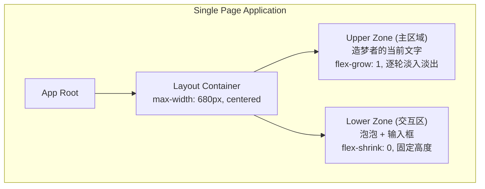
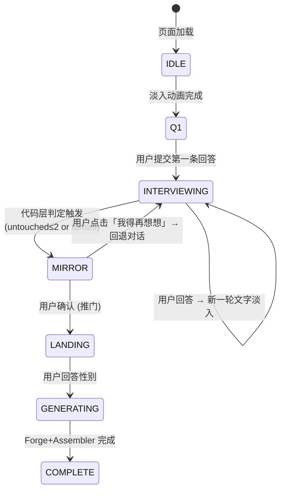
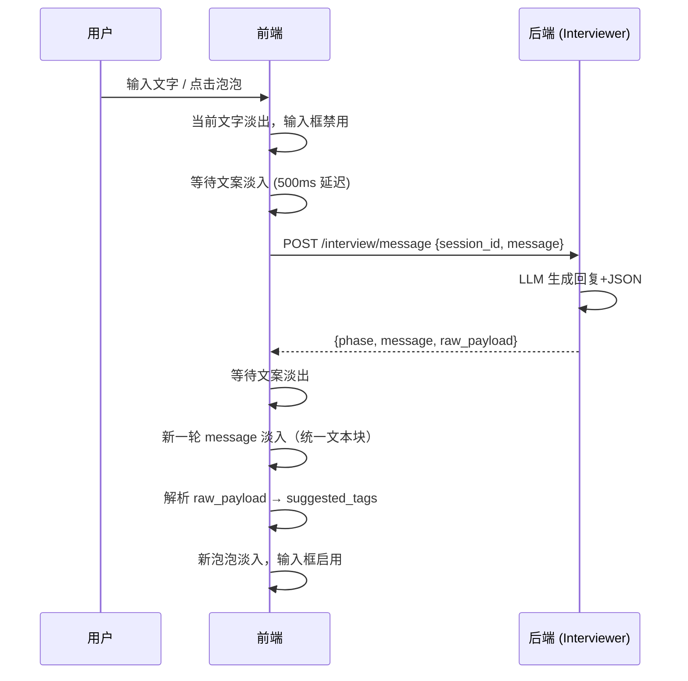
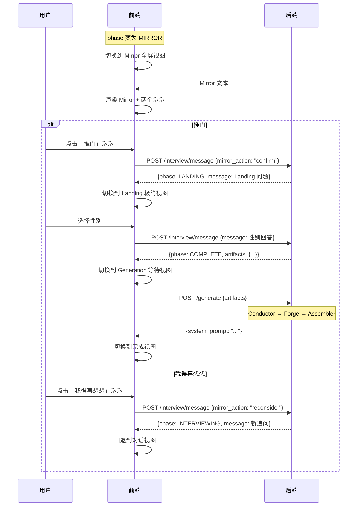
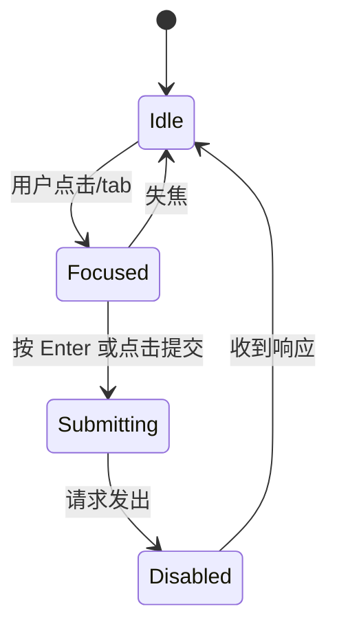
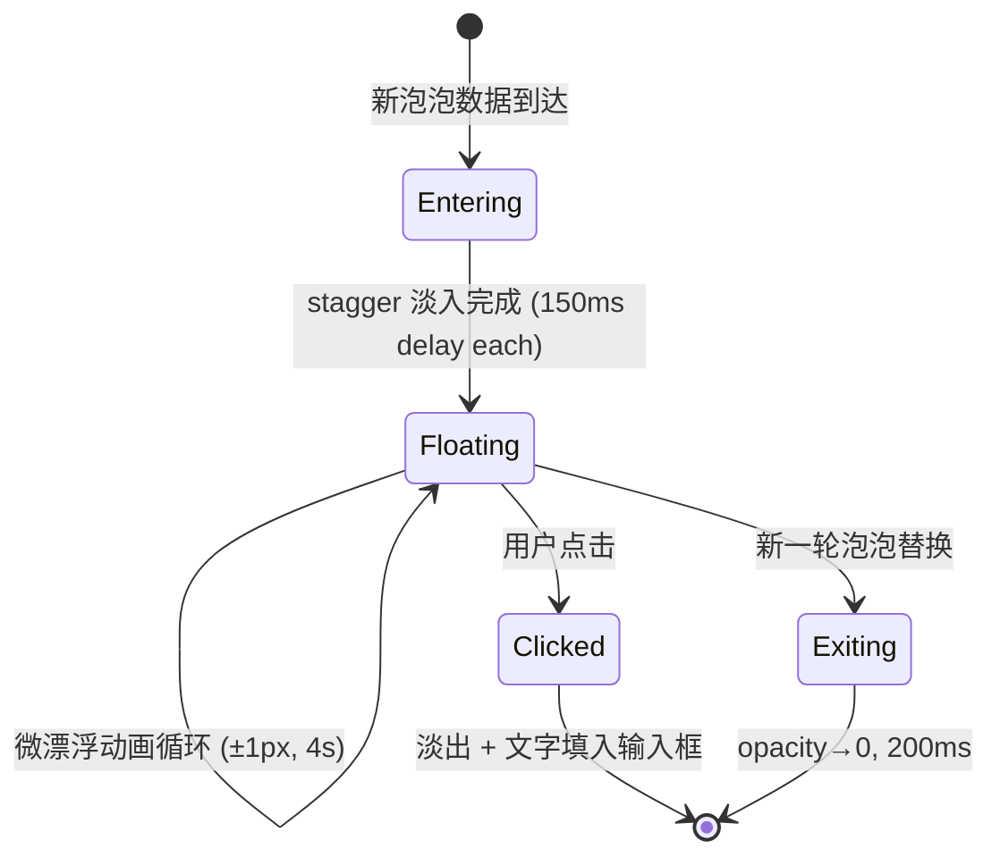

# OSeria Architect — 可执行 UI/UX 规格书 (Executable UI/UX Specification)

> **角色**: Vera — Chief of Staff & Strategic Architect
> **日期**: 2026-03-11
> **版本**: v3.4 — 内部一致性收口 (Mirror 契约/Phase 类型/完成态/安全区)
> **设计体系**: 水墨留白 (Ink & Void)
> **字体**: 霞鹜文楷 Light (LXGW WenKai, `font-weight: 300`)
> **色板**: 宣纸白 `#FAFAF7` / 墨黑 `#1A1A1A` / 墨灰 `#6B6B6B` / 淡金 `#C9A96E`

---

## 1. 页面信息架构 (Information Architecture)

### 1.1 页面模型

本产品是**单页应用 (SPA)**，无路由跳转。所有阶段在同一视口 (viewport) 内通过状态切换实现。



### 1.2 上下分区布局

**核心布局原则**：屏幕分为上下两区。上区是**内容主体**（造梦者当前轮的文字），下区是**交互模块**（泡泡 + 输入框）。

**显示模型：逐轮淡入淡出**。画面上永远只有当前轮次造梦者的文字。用户提交回答后，当前文字淡出，等待片刻，新一轮文字淡入。不提供历史回看。每一轮都是一张新的净纸。

```
┌───────────────────────────────────────────────┐
│                                               │
│              UPPER ZONE (主区域)                │
│              当前轮次造梦者的文字                 │
│              flex-grow: 1                      │
│              逐轮 fade 切换（无滚动）             │
│              占据视口主要篇幅                     │
│                                               │
│                                               │
│                                               │
├───────────────────────────────────────────────┤
│                                               │
│              LOWER ZONE (交互模块)              │
│              泡泡区 + 输入框                     │
│              flex-shrink: 0                    │
│              固定高度 ~200px                    │
│                                               │
└───────────────────────────────────────────────┘
```

**CSS 布局骨架**：
```css
.layout {
  display: flex;
  flex-direction: column;
  height: 100dvh;              /* F4: dvh 处理移动端键盘 */
  max-width: 680px;
  margin: 0 auto;
  padding: 40px 40px 24px;
  background: #FAFAF7;
}
.upper-zone {
  flex: 1 1 auto;
  display: flex;
  align-items: center;        /* 文字垂直居中 */
  justify-content: center;
  padding-bottom: 24px;
  overflow: hidden;           /* 无滚动 */
}
.lower-zone {
  flex: 0 0 auto;
  padding-bottom: env(safe-area-inset-bottom, 0px);  /* iOS Home Indicator */
  /* 泡泡区 ~120px + 输入框 ~56px + 间距 */
}
```

---

## 2. 关键流程图 (Key Flow Diagrams)

### 2.1 全局状态机



> [!IMPORTANT]
> **`BackendPhase` vs `UiPhase`**：后端 [InterviewPhase](file:///Users/okfin3/project/architect-agent-prototype/Architect/interview_controller.py#15-21) 枚举只有 4 个值（`interviewing / mirror / landing / complete`）。前端定义了独立的 `UiPhase` 类型，增加了 `idle`、`q1`、`generating` 三个纯前端状态。后端返回的 `BackendPhase` 通过映射逻辑转换为 `UiPhase`（见 §6.1）。本文档中 **状态机、状态矩阵、组件 Props 均使用 `UiPhase`**；API 契约使用 `BackendPhase`。

### 2.2 单轮对话流程



### 2.3 Mirror → Landing → Generation 流程



---

## 3. 各阶段界面草图 (Stage Wireframes)

### 3.0 全局 Layout Grid

```
← 40px →│←────────── 680px ──────────→│← 40px →
         │                            │
         │    视口居中，白底卷轴        │
         │                            │
```

### 3.1 Stage: Q1 — 空白卷轴

```
┌─ UPPER ZONE ────────────────────────────────┐
│                                             │
│                  (大量留白)                   │
│                                             │
│  「闭上眼。在这个为你准备的世界里，            │
│   你想在推开窗后看到怎样的景象？              │
│   是飞剑划破云霄，是霓虹闪烁的未来都市，       │
│   是魔法塔尖的星光，                         │
│   还是现代社会里的另一种可能？                 │
│   随意描述你脑海中的第一幕画卷。」             │
│                                             │
│                  (大量留白)                   │
│                                             │
├─ LOWER ZONE ────────────────────────────────┤
│                                             │
│          「这是什么？」                       │
│                    「你是谁？」               │
│       「我该说什么？」                        │
│                                             │
│   ┌─────────────────────────────────────┐   │
│   │  或者你有不同的想法？                  │   │
│   └─────────────────────────────────────┘   │
│                                             │
└─────────────────────────────────────────────┘
```

**说明**：
- Upper zone 只有 Q1 文本 + 大量留白。文字垂直居中或偏上 1/3
- Lower zone 三个教程泡泡 + 输入框
- 输入框 placeholder: `"或者你有不同的想法？"`

### 3.2 Stage: Q2-Q5 — 逐轮淡入淡出

画面上**永远只有当前轮次**造梦者的文字。用户提交后，当前文字淡出 → 等待 → 新文字淡入。不显示用户之前的回答，不显示历史。每一轮都是一张干净的纸。

```
┌─ UPPER ZONE ────────────────────────────────┐
│                                             │
│                  (留白)                      │
│                                             │
│  「在这样一座仙人视凡人如草芥的世界里，        │
│   山脚面摊的烟火气大概是最奢侈的事物。         │
│   那个卖面的老头——                           │
│   他是选择了这碗面，                          │
│   还是被什么逼到了这碗面前？」                 │
│                                             │
│                  (留白)                      │
│                                             │
├─ LOWER ZONE ────────────────────────────────┤
│                                             │
│          「一剑光寒十九州」                    │
│                 「街角卖面的散修」             │
│     「大宗门的弃徒」                          │
│                                             │
│   ┌─────────────────────────────────────┐   │
│   │  或者你有不同的想法？                  │   │
│   └─────────────────────────────────────┘   │
│                                             │
└─────────────────────────────────────────────┘
```

**关键设计说明**：
- **无用户消息展示**：用户之前说了什么，不在画面上——造梦者的文字本身就是对用户话语的「接住」，用户能感受到自己被听见了
- **AI 输出是统一文本块**：回声和追问是一体的，无视觉区分。LLM 自然地将「接住」和「追问」融为一段流畅的文字
- **文字居中偏上**：`align-items: center` 或 `padding-top: 20vh`，保证大量留白
- **淡入淡出过渡**：旧文字 fade out (400ms) → 间隔 → 新文字 fade in (600ms)
- **无滚动、无历史回看**：强制用户沉浸在当下

### 3.3 Stage: Mirror — 全屏叙事揭示

Mirror 阶段切换 layout：**upper zone 和 lower zone 合并为全屏**。选项以**泡泡形态**呈现，与 `suggested_tags` 视觉一致。

```
┌─ FULL SCREEN ───────────────────────────────┐
│                                             │
│                  (留白)                      │
│                                             │
│      「所以我看到的是这样一个世界 ——           │
│                                             │
│       仙门林立，门内修士视凡人如蝼蚁。        │
│       而你，是山脚小镇上一家面店的跑堂，      │
│       每天看着飞剑划过天际，                  │
│       心里却只想着今天的面汤                  │
│       咸了还是淡了。                         │
│                                             │
│       但总有一天，                           │
│       有人会推开你的店门，                    │
│       带来一个你无法拒绝的故事。              │
│                                             │
│       这就是你想推开的那扇门吗？」            │
│                                             │
│                                             │
│              「推门」                         │
│                        「我得再想想」         │
│                                             │
└─────────────────────────────────────────────┘
```

**说明**：
- 字号 1.4em，行距 2.2
- 文字居中对齐
- 关键意象词可用淡金色 `#C9A96E`
- **两个泡泡**（与 `suggested_tags` 泡泡视觉一致：无边框、半随机位置、墨灰色文字）
- 底部 `padding-bottom: 60px`

**泡泡与后端映射**：
| 泡泡文案 | 前端发送字段 | 后端行为 |
|---|---|---|
| 推门 | `mirror_action: "confirm"` | confirm → 进入 LANDING |
| 我得再想想 | `mirror_action: "reconsider"` | reject → 回到 INTERVIEWING |

> [!WARNING]
> **后端改造需求**：当前后端 [_classify_mirror_feedback](file:///Users/okfin3/project/architect-agent-prototype/Architect/interviewer.py#199-208) 仍然基于字符串 token 匹配。未来的 FastAPI 路由层需增加对 `mirror_action` 字段的解析，直接根据结构化值分发到 confirm/reject 逻辑，不再依赖关键词匹配。在此之前，前端可以同时发送 `message: "推门"` / `message: "重来"` 作为 fallback 兼容。

### 3.4 Stage: Landing — 波谷

```
┌─ FULL SCREEN ───────────────────────────────┐
│                                             │
│                                             │
│                                             │
│                                             │
│    「那么，最后两个很简单的问题。」             │
│                                             │
│    —— 你的性别？                             │
│       ○ 男  ○ 女  ○ 无所谓                   │
│                                             │
│    —— 在这个世界里推开那扇门的你，             │
│       是男是女？                             │
│       ○ 男  ○ 女  ○ 他者  ○ 随世界定          │
│                                             │
│                                             │
│                       [ 开始 ]               │
│                                             │
│                                             │
└─────────────────────────────────────────────┘
```

**说明**：全屏极简。Radio buttons 无边框，纯文字选择。

### 3.5 Stage: Generation — 等待

```
┌─ FULL SCREEN ───────────────────────────────┐
│                                             │
│                                             │
│                                             │
│                                             │
│                                             │
│                                             │
│        「让我为你完成这个世界。」               │
│                                             │
│          (fade out → fade in 下一条)          │
│                                             │
│                                             │
│                                             │
│                                             │
│                                             │
│                                             │
└─────────────────────────────────────────────┘
```

### 3.6 Stage: Complete — 世界诞生

```
┌─ FULL SCREEN ───────────────────────────────┐
│                                             │
│             「你的世界，已经诞生。」           │
│                                             │
│   ┌─ BlueprintView ──────────────────────┐  │
│   │ 世界基调 / 主角起点 / 核心张力         │  │
│   │ 已激活维度 / 留白维度 / 玩家侧写       │  │
│   └──────────────────────────────────────┘  │
│                                             │
│   「查看完整 Prompt」  「复制蓝图摘要」        │
│                                             │
│   「重新生成」          「再造一个世界」        │
│                                             │
└─────────────────────────────────────────────┘
```

**说明**：
- 完成态默认进入 **BlueprintView**，服务大多数用户；不直接暴露长篇 Prompt
- **「查看完整 Prompt」** 打开二级内容层 `<PromptInspector>`，展示完整 `system_prompt`
- `<PromptInspector>` 必须是**独立可滚动容器**，而不是让整页进入长滚动模式
- **「复制蓝图摘要」**：复制蓝图页的结构化摘要
- **「重新生成」**：保留当前 `artifacts`，重新调用 `/api/generate`
- **「再造一个世界」**：清空当前会话并重新开始（优先通过前端状态重置；`location.reload()` 仅作最简 fallback）
- `<PromptInspector>` 内的全文使用 `monospace` 渲染，可全选复制

#### 3.6.0 产品原则：双层结果页

完成态必须同时服务两类用户：
- **普通用户**：只想快速理解“这个世界是什么”，默认看到 `BlueprintView`
- **专业用户**：需要完整 Prompt 做二次创作或调试，通过 `PromptInspector` 查看全文

**Progressive Disclosure 规约**：
- 第一层永远是 `BlueprintView`
- 第二层才是 `PromptInspector`
- 不允许默认直接展开完整 Prompt 淹没普通用户

#### 3.6.0.1 BlueprintView 信息层级

`BlueprintView` 必须按以下顺序展示：
1. **Hero 句**：一句完成语，如「你的世界，已经诞生。」
2. **世界摘要**：2-4 句，概括世界基调、主角起点、核心张力
3. **核心模块**：已激活的维度 / 规则模块
4. **留白维度**：emergent dimensions，说明这些内容将由运行时自然涌现
5. **玩家侧写**：对受访者偏好的简短总结
6. **操作区**：查看完整 Prompt / 复制蓝图摘要 / 重新生成 / 再造一个世界

> [!IMPORTANT]
> `BlueprintView` 是一个**产品化结果页**，不是把后端 JSON 原样 dump 到屏幕上。它应使用用户可读的文案标签，而不是工程字段名。

#### 3.6.1 二级内容层：Prompt Inspector

```css
.prompt-inspector {
  width: min(880px, 92vw);
  max-height: min(72dvh, 960px);
  overflow-y: auto;
  padding: 24px;
  border: 1px solid rgba(26, 26, 26, 0.1);
  background: #FAFAF7;
}
.prompt-content {
  font-family: ui-monospace, SFMono-Regular, Menlo, monospace;
  white-space: pre-wrap;
  word-break: break-word;
  line-height: 1.7;
}
```

> [!IMPORTANT]
> 完成态允许 `<PromptInspector>` 自身滚动；这不违反前文“访谈阶段无历史滚动”的沉浸原则。**无滚动约束只适用于访谈阶段，不适用于结果阅读阶段。**

**交互规约**：
- `PromptInspector` 默认关闭
- 打开时以 modal / side panel 形式覆盖在 `BlueprintView` 之上
- 打开后背景不可交互
- 支持 `Esc` 关闭
- 支持「复制 Prompt」按钮
- 关闭后用户回到 `BlueprintView` 原位置，不丢失上下文

> [!NOTE]
> 这是 MVP 完成态。未来可扩展为"直接开始游戏（跳转到运行时）"或"导出为文件"等动作。当前阶段只需要让用户拿到生成结果即可。

---

## 4. 组件层级与状态说明 (Component Hierarchy)

### 4.1 组件树

```
<App>
  ├── <LayoutShell>                    # 680px 居中容器
  │   ├── <UpperZone>                  # 主内容区（flex-grow）
  │   │   ├── <CurrentScene>           # 当前轮次文字（逐轮淡入淡出）
  │   │   ├── <MirrorView>            # Mirror 全屏视图
  │   │   │   ├── <MirrorText>        # Mirror 文字
  │   │   │   └── <MirrorBubbles>     # 推门 / 我得再想想（泡泡形态）
  │   │   ├── <LandingView>           # Landing 性别选择
  │   │   ├── <GenerationView>        # 等待视图
  │   │   │   └── <RotatingCopy>      # 淡入淡出提示语
  │   │   └── <CompleteView>          # 结果页总容器
  │   │       ├── <BlueprintView>     # 默认结果层（普通用户）
  │   │       │   ├── <BlueprintHero>
  │   │       │   ├── <BlueprintSections>
  │   │       │   │   ├── <BlueprintSummaryCard>
  │   │       │   │   ├── <DimensionChips>
  │   │       │   │   └── <PlayerProfileCard>
  │   │       │   └── <ResultActions>
  │   │       └── <PromptInspector>   # 二级内容层（专业用户）
  │   │           ├── <PromptScrollContainer>
  │   │           └── <PromptActions>
  │   └── <LowerZone>                 # 交互模块区（flex-shrink: 0）
  │       ├── <BubbleField>           # 泡泡漂浮区
  │       │   └── <Bubble>            # 单个泡泡
  │       ├── <TutorialHint>          # Q1 冷启动解释提示
  │       └── <InputArea>             # 输入框
  │           └── <input>
  └── <WaitingOverlay>                # 等待遮罩（可选）
```

> **注意**：没有 `<ConversationList>`。不维护对话历史列表。画面上永远只有一个 `<CurrentScene>`。

### 4.2 各组件 Props & State

#### `<App>` — 根组件
```typescript
// State
phase: UiPhase                 // 'idle' | 'q1' | 'interviewing' | 'mirror' | 'landing' | 'generating' | 'complete'
sessionId: string | null
currentMessage: string | null  // 造梦者当前轮的文字（统一文本块）
currentBubbles: string[]       // suggested_tags
isWaitingForResponse: boolean
isTransitioning: boolean       // 淡入淡出过渡中
activeTutorialHint: string | null
artifacts: InterviewArtifacts | null
blueprint: BlueprintSummary | null
systemPrompt: string | null
isPromptInspectorOpen: boolean
generateStatus: 'idle' | 'loading' | 'success' | 'error'
generateError: ErrorResponse['error'] | null
```

#### `<CurrentScene>` — 当前轮文字
```typescript
// Props
message: string                // 统一的 AI 输出文本（回声+追问一体）
isVisible: boolean             // 控制 fade in/out

// 动画: isVisible 变化时触发 opacity 过渡
// fade out: 400ms ease-out
// fade in:  600ms ease-in
```

#### `<BubbleField>` — 泡泡容器
```typescript
// Props
bubbles: string[]             // Q1 时为教程泡泡文案，Q2+ 为 suggested_tags
mode: 'tutorial' | 'tags'
onBubbleClick: (text: string) => void

// Internal State
positions: { x: number, y: number }[]  // 基于栅格 + 随机偏移生成
```

#### `<Bubble>` — 单个泡泡
```typescript
// Props
text: string
position: { x: number, y: number }
mode: 'tutorial' | 'tags'
onClick: () => void

// States
idle       → 颜色: #6B6B6B (tags) 或 #AAAAAA (tutorial)
hover      → 颜色: #1A1A1A，背景: rgba(26,26,26,0.06)
clicked    → fade out + 文字飞入输入框 (tags) 或 显示 tutorial hint (tutorial)
exiting    → opacity 0，200ms transition
```

#### `<TutorialHint>` — Q1 解释提示
```typescript
// Props
hint: string | null

// UX Contract
// - 仅在 Q1 阶段出现
// - tutorial bubble 点击后淡入一行解释文案
// - 不自动提交，不污染 input value
```

#### `<InputArea>` — 输入框
```typescript
// Props
placeholder: string           // "或者你有不同的想法？"
disabled: boolean
onSubmit: (text: string) => void

// States
idle       → placeholder 可见，border: 1px solid rgba(26,26,26,0.1)
focused    → border: 1px solid rgba(26,26,26,0.3)
disabled   → opacity: 0.5，不可输入（等待 AI 回复时）

// Keyboard Contract
// - Enter: 提交（仅非 IME composition 且非 ShiftKey）
// - Shift+Enter: 换行
// - compositionstart ~ compositionend 期间，Enter 不触发提交
```

#### `<MirrorView>` — Mirror 全屏
```typescript
// Props
mirrorText: string
onConfirm: () => void         // 「推门」泡泡
onReconsider: () => void       // 「我得再想想」泡泡

// 无 Internal State（不再需要 showRefineInput）
```

#### `<RotatingCopy>` — 淡入淡出提示语
```typescript
// Props
copyList: string[]
intervalMs: number            // 每条停留时间（默认 4000ms）
fadeDurationMs: number        // 淡入淡出时长（默认 800ms）
```

#### `<CompleteView>` — 结果页容器
```typescript
// Props
blueprint: BlueprintSummary
systemPrompt: string
isPromptInspectorOpen: boolean
generateStatus: 'success' | 'error'
generateError: ErrorResponse['error'] | null
onOpenPromptInspector: () => void
onClosePromptInspector: () => void
onRetryGenerate: () => void
onRestart: () => void
```

#### `<BlueprintView>` — 蓝图展示层
```typescript
// Props
blueprint: BlueprintSummary
onOpenPromptInspector: () => void
onCopyBlueprint: () => void
onRetryGenerate: () => void
onRestart: () => void

// UX Contract
// - 默认结果层
// - 不展示原始 JSON key
// - 面向普通用户，优先强调“这个世界是什么”
```

#### `<PromptInspector>` — 完整 Prompt 查看器
```typescript
// Props
systemPrompt: string
isOpen: boolean
onClose: () => void
onCopyPrompt: () => void

// Layout Contract
// - 独立滚动容器
// - 不影响 BlueprintView 的垂直节奏
// - 默认关闭
```

#### `<ResultActions>` — 结果页操作区
```typescript
// Primary Actions
// - 查看完整 Prompt
// - 复制蓝图摘要
// - 重新生成
// - 再造一个世界

// Feedback Contract
// - 复制成功后显示 1.5s 的轻量确认文案：「已复制」
// - 重新生成期间禁用所有结果页操作
```

---

## 5. 组件状态矩阵 (Component State Matrix)

### 5.1 全局 UiPhase → UI 映射

| `UiPhase` | Upper Zone 显示 | Lower Zone 显示 | 全屏接管 |
|---|---|---|---|
| `'idle'` | 空白 | 隐藏 | 否 |
| `'q1'` | Q1 文本（居中） | 教程泡泡 + 输入框 | 否 |
| `'interviewing'` | `<CurrentScene>` 当前轮文字 | `suggested_tags` 泡泡 + 输入框 | 否 |
| `'mirror'` | `<MirrorView>` | 隐藏 | **是** |
| `'landing'` | `<LandingView>` | 隐藏 | **是** |
| `'generating'` | `<GenerationView>` | 隐藏 | **是** |
| `'complete'` | `<CompleteView>` 蓝图结果页 + Prompt Inspector + 结果操作区 | 隐藏 | **是** |

### 5.2 `<InputArea>` 状态转换



### 5.3 `<Bubble>` 生命周期



### 5.4 泡泡布局算法

泡泡**不使用纯随机绝对定位**。采用「栅格 + 抖动」策略防止重叠和溢出：

```typescript
// 泡泡区域: 680px × 120px，划分为 3 列（每列 ~220px）
// 每个泡泡分配一个栅格槽位，然后在槽位内施加随机偏移
function layoutBubbles(texts: string[], containerWidth: number): Position[] {
  const columnCount = texts.length  // 通常 3
  const colWidth = containerWidth / columnCount
  return texts.map((_, i) => ({
    x: i * colWidth + randomJitter(colWidth * 0.3),  // 列内 ±30% 偏移
    y: randomJitter(40)                               // 垂直 ±40px 偏移
  }))
}
```

**防溢出规则**：
- 泡泡 `white-space: nowrap`，超长文案自动截断 `text-overflow: ellipsis`，`max-width: 200px`
- 位置 clamp 到容器边界内（`Math.max(0, Math.min(x, containerWidth - bubbleWidth))`）
- Mirror 泡泡（推门/我得再想想）同样使用此布局，只是 `columnCount = 2`

---

## 6. 接口数据结构 / 前后端契约 (API Data Contracts)

### 6.1 后端数据结构 → 前端 TypeScript 映射

**后端 Python ([interviewer.py](file:///Users/okfin3/project/architect-agent-prototype/Architect/interviewer.py))**:
```python
class InterviewPhase(Enum):
    INTERVIEWING = "interviewing"
    MIRROR = "mirror"
    LANDING = "landing"
    COMPLETE = "complete"

@dataclass
class InterviewStepResult:
    phase: InterviewPhase
    message: str | None
    artifacts: InterviewArtifacts | None
    raw_payload: dict | None
```

**前端 TypeScript**:
```typescript
// BackendPhase: 后端返回的原始 phase 值（wire format）
type BackendPhase = 'interviewing' | 'mirror' | 'landing' | 'complete'

// UiPhase: 前端状态机，比后端多 3 个状态
type UiPhase = 'idle' | 'q1' | 'interviewing' | 'mirror' | 'landing' | 'generating' | 'complete'

// 映射逻辑：
// - 页面加载时 → UiPhase = 'idle'
// - /start 返回 phase='interviewing' 且 raw_payload=null → UiPhase = 'q1'
// - /message 返回 phase='interviewing' 且 raw_payload有值 → UiPhase = 'interviewing'
// - Landing 提交后 收到 phase='complete' → UiPhase 先切换为 'generating'
// - /generate 完成后 → UiPhase = 'complete'

interface InterviewStepResponse {
  phase: BackendPhase
  message: string | null              // 造梦者的回复文本（统一渲染，无需拆分）
  artifacts: InterviewArtifacts | null // 仅 phase=complete 时有值
  raw_payload: {                       // phase=interviewing 时有值；注意：INTERVIEWING->MIRROR 转折轮 phase=mirror 但仍携带 raw_payload
    turn: number
    question: string
    suggested_tags: string[]           // 3 个泡泡文案
    routing_snapshot: RoutingSnapshot
    vibe_flavor: string
  } | null
}

interface RoutingSnapshot {
  confirmed: string[]
  exploring: string[]
  excluded: string[]
  untouched: string[]
}

interface InterviewArtifacts {
  routing_tags: {
    confirmed_dimensions: string[]
    emergent_dimensions: string[]
    excluded_dimensions: string[]
  }
  narrative_briefing: string
  player_profile: string
}

interface BlueprintSummary {
  title: string
  world_summary: string
  protagonist_hook: string
  core_tension: string
  tone_keywords: string[]
  player_profile: string
  confirmed_dimensions: string[]
  emergent_dimensions: string[]
  forged_modules: Array<{
    dimension: string
    pack_id: string | null
  }>
}
```

### 6.2 前端消息渲染

后端 [message](file:///Users/okfin3/project/architect-agent-prototype/Architect/interviewer.py#64-81) 字段是造梦者的完整回复文本。**前端直接渲染，无需拆分**。

回声（接住用户的话）和追问（下一个问题）是 LLM 人格自然生成的统一文本。前端不区分，不做任何解析或拆分，直接作为 `<CurrentScene>` 的内容渲染。

> [!NOTE]
> **无后端改动需求**。之前提议的 `<<ECHO>>` / `<<QUESTION>>` 标签方案已废弃。后端 `visible_text` 保持原样输出。

### 6.3 REST API 端点规格

> [!NOTE]
> 当前后端是 CLI 入口（[main.py](file:///Users/okfin3/project/architect-agent-prototype/Architect/main.py)）。以下规格面向未来的 FastAPI 接口层。

#### `POST /api/interview/start`

创建新会话并返回 Q1。

```typescript
// Request: 无 body
// Response:
{
  session_id: string,
  phase: "interviewing",        // BackendPhase 值，前端映射为 UiPhase = 'q1'（因 raw_payload=null）
  message: string,              // Q1 固定文本（common.py OPENING_QUESTION）
  raw_payload: null             // Q1 无 LLM 输出
}
```

#### `POST /api/interview/message`

发送用户消息，获取 AI 回复。

```typescript
type InterviewMessageRequest =
  | {
      session_id: string
      message: string
      mirror_action?: never
    }
  | {
      session_id: string
      mirror_action: 'confirm' | 'reconsider'
      message?: string // optional fallback，仅用于后端改造前兼容旧字符串协议
    }

// 规则：
// - 正常对话阶段：发送 message
// - Mirror 阶段：发送 mirror_action
// - 兼容期：Mirror 阶段可同时发送 mirror_action + message("推门"/"重来") 作为 fallback

// Response: InterviewStepResponse (见 §6.1)
```

#### `POST /api/generate`

触发 Conductor → Forge → Assembler 生成流程。

```typescript
// Request:
{
  session_id: string,
  artifacts: InterviewArtifacts
}

// Response:
{
  blueprint: BlueprintSummary   // 蓝图展示页所需的摘要数据
  system_prompt: string         // 最终生成的完整 System Prompt
  // 注意：forge_stats 为未来扩展设计，当前后端未实现
  // 如需实现，需在 Forge.execute() 中增加统计逻辑
}
```

> [!IMPORTANT]
> `/api/generate` 成功后，前端必须同时持有 `blueprint` 与 `system_prompt`。前者用于默认展示，后者用于 `<PromptInspector>`。

**复制蓝图摘要格式**：
```text
# {title}

世界摘要：
{world_summary}

主角起点：
{protagonist_hook}

核心张力：
{core_tension}

核心维度：
- {confirmed_dimensions...}

留白维度：
- {emergent_dimensions...}

玩家侧写：
{player_profile}
```

---

## 7. 加载态 (Loading States)

### 7.1 对话轮次间等待 (1-3 秒)

**触发时机**：用户提交消息后，等待 LLM 回复。

**行为规约**：
1. **立即**：输入框 `disabled`，泡泡淡出
2. **500ms 后**（如果仍未收到响应）：在 upper zone 底部淡入一行等待文案
3. **收到响应后**：等待文案淡出，新一轮文字淡入

**等待文案库** (`waitingCopy.interview`):
```typescript
const INTERVIEW_WAITING_COPY = [
  "别催，我思考的时间越长，效果越好。",
  "让我再想想……",
  "你说的那个世界，我好像见过。",
  "这很有意思。",
]
// 随机选取一条
```

**动画规格**：
```css
.waiting-copy {
  color: #6B6B6B;
  font-size: 0.95em;
  text-align: center;
  animation: fadeIn 600ms ease-out;
}
@keyframes fadeIn {
  from { opacity: 0; }
  to { opacity: 1; }
}
```

### 7.2 Generation 阶段等待 (5-15 秒)

**触发时机**：用户在 Landing 提交后，进入 Generation。

**行为规约**：
1. **立即**：切换到全屏 `<GenerationView>`
2. 第一条文案固定：「让我为你完成这个世界。」
3. 每 4 秒淡入淡出切换一条
4. 完成后最后一条淡出，结果视图淡入

**等待文案库** (`waitingCopy.generation`):
```typescript
const GENERATION_WAITING_COPY = [
  "让我为你完成这个世界。",
  "正在为你编织法则……",
  "你的每一句话，都在变成世界的一条规则。",
  "快好了。",
]
// 顺序播放，非随机
```

**动画规格**：
```css
.rotating-copy {
  animation: fadeInOut 4800ms ease-in-out; /* 800ms in + 3200ms hold + 800ms out */
}
@keyframes fadeInOut {
  0%   { opacity: 0; }
  17%  { opacity: 1; }  /* fade in 完成 (800ms / 4800ms) */
  83%  { opacity: 1; }  /* 保持 */
  100% { opacity: 0; }  /* fade out */
}
```

---

## 8. 异常态 (Error States)

### 8.1 API 超时 (>10 秒无响应)

**用户看到**：等待文案切换为固定文案 →「造梦者似乎走远了……再等一下。」`color: #6B6B6B`

**内部行为**：
- **不自动重试**。访谈接口是有状态的（[process_turn](file:///Users/okfin3/project/architect-agent-prototype/Architect/interview_controller.py#74-101) 每次调用都会推进 `turn++` 和状态机），如果首次请求只是慢不是失败，自动重试会导致双推进（跳轮次、误触发 Mirror、误进入 Landing）。
- 30 秒后显示：「出了点问题。」+ 文字按钮「重新开始」（刷新页面，重新创建 session）
- 不暴露任何技术细节

> [!IMPORTANT]
> **幂等性规约**：前端对 `/api/interview/message` 接口**永不自动重试**。所有失败都由用户主动点击「重新开始」来恢复。未来如果实现重试，必须在后端 API 层增加 `request_id` 幂等键。

### 8.2 LLM 输出解析失败

**场景**：[_parse_interview_response](file:///Users/okfin3/project/architect-agent-prototype/Architect/interviewer.py#161-177) 抛出 `ValueError`（缺少 `routing_snapshot` 或 JSON 格式错误）

**用户看到**：与超时相同的兜底文案。前端不区分超时和解析失败。

**内部行为**：当前后端直接抛出异常。**需要在 API 层（尚未实现的 FastAPI 路由）增加 try-except 捕获 `ValueError` 并返回 error response**。这是后端待实施的健壮性改进。

### 8.3 网络断连

**检测方式**：`navigator.onLine` + fetch catch

**用户看到**：底部淡入一行：「网络似乎断了。」—— 恢复后自动消失

### 8.4 统一错误响应结构

后端所有错误应返回统一 JSON 结构（HTTP 4xx/5xx）：

```typescript
interface ErrorResponse {
  error: {
    code: string          // 机器可读："timeout" | "parse_error" | "internal" | "session_expired" | "upstream_unavailable" | "generate_failed"
    message: string       // 人类可读（仅调试用，不展示给用户）
    retryable: boolean    // 前端是否可尝试重试
  }
}
```

**前端规则**：
- 收到 `ErrorResponse` 或网络错误时，根据 `code` 选择展示文案（见下表）
- 永不展示 [message](file:///Users/okfin3/project/architect-agent-prototype/Architect/interviewer.py#64-81) 字段给用户

### 8.5 `/generate` 失败恢复策略

`/generate` 是**第二跳接口**。Landing 完成后，前端已经持有 `artifacts`，因此生成失败时**不得要求用户重做整段访谈**。

**恢复分层**：
- `retryable = true`
  例：网络抖动、上游模型 5xx、超时、暂时不可用
  行为：保留 `artifacts`，展示「重新生成」按钮；不清空会话
- `code = "session_expired"` 或协议不兼容
  行为：提示重新开始；旧 `artifacts` 作废
- `code = "generate_failed"` / `code = "internal"` 且 `retryable = false`
  行为：保留 `artifacts`，允许用户手动再试一次；若仍失败，再提示重新开始

**前端状态规约**：
- `generateStatus = 'loading'`：显示 `<GenerationView>`
- `generateStatus = 'error'`：切换到 `<CompleteView>` 的错误分支，显示失败文案 + 「重新生成」/「再造一个世界」
- `generateStatus = 'success'`：显示正常蓝图页

**错误分支文案策略**：
- `retryable = true`：显示「法则还没有编织完成。」+「重新生成」
- `code = "session_expired"`：显示「这个世界已经散了。」+「再造一个世界」
- `retryable = false` 且 `code = "internal"`：显示「出了点问题。」+「重新生成」和「再造一个世界」

> [!IMPORTANT]
> `/generate` 的拆分价值就在于**失败后可重试生成而不丢失访谈成果**。如果失败后仍强制用户从 Q1 重来，这个接口拆分就是伪设计。

### 8.6 异常态 UI 规约

| 异常 | 用户可见文案 | 颜色 | 位置 | 交互 |
|---|---|---|---|---|
| 等待超时 | 「造梦者似乎走远了……再等一下。」 | `#6B6B6B` | upper zone 底部居中 | 无 |
| 完全失败 | 「出了点问题。」 | `#6B6B6B` | upper zone 居中 | 「重新开始」按钮 |
| 网络断连 | 「网络似乎断了。」 | `#6B6B6B` | 底部固定条 | 恢复后自动消失 |
| 生成失败（可重试） | 「法则还没有编织完成。」 | `#6B6B6B` | CompleteView 操作区 | 「重新生成」按钮 |

**设计原则**：所有异常文案都使用墨灰色 `#6B6B6B`，与等待文案同级——不使用红色、不弹 alert、不暴露技术信息。

---

## 9. 空态与边界态 (Empty & Edge States)

### 9.1 空输入提交

**行为**：忽略。输入框不为空才启用提交（Enter 键 / 提交按钮）。

### 9.1.1 输入法与键盘边界

**行为**：
- 中文 / 日文 / 韩文输入法处于 composition 状态时，按 Enter **不得提交**
- `Shift+Enter` 永远插入换行
- 移动端使用系统 `send` / `done` 键时，等价于提交
- Landing 阶段不再使用自由文本输入，必须使用显式选择控件

### 9.2 极短回答 ("随便"、"不知道")

**前端行为**：无特殊处理。正常提交给后端。

**后端行为**：LLM 的 AI Imputation 法则（[interviewer_system_prompt.md](file:///Users/okfin3/project/architect-agent-prototype/Architect/prompts/interviewer_system_prompt.md)）会接管——主动脑补并继续推进。前端无感知。

### 9.3 极长回答 (>500 字)

**行为**：输入框不限制字数（`<textarea>` 自适应高度，但 `max-height: 120px` + `overflow-y: auto`）。前端可在字数 >500 时，placeholder 变为「够了够了，说重点。」（Zab 风格的嘴贱 UX）。

**是否截断**：不截断。全文发送给后端。

### 9.3.1 教程泡泡行为

Q1 阶段的三个 tutorial bubbles 不应像 `suggested_tags` 一样把文字填进输入框。它们的职责是**降低冷启动焦虑**，不是替用户发言。

映射规约：
- 「这是什么？」 → hint: 「这是一次世界构建访谈。你随便描述脑海里的第一幕就行。」
- 「你是谁？」 → hint: 「我是造梦者。负责把你的描述编织成一个可运行的世界蓝图。」
- 「我该说什么？」 → hint: 「不用完整设定，只说一个画面、一种气味、一个想扮演的人都可以。」

**交互**：
- 点击 bubble 后，仅更新 `<TutorialHint>`
- 不触发提交
- 不写入输入框
- 用户一旦开始输入，`TutorialHint` 自动淡出

### 9.4 `meta:sandbox_start` (极低信号密度)

**场景**：用户多轮极简回答 → 大量维度 untouched → Mirror 极简 → Generation 输出极简 System Prompt。

**前端行为**：无特殊处理。这是合法的用户选择（决策 7.3），不是系统故障。等待文案、Generation 流程与正常情况完全一致。

### 9.5 Mirror 反复「我得再想想」

**行为**：不限次数。每次点击「我得再想想」会回退到 INTERVIEWING 阶段，造梦者会继续追问，直到再次触发 Mirror。

**“盲打”风险与缓解**：用户回退后看不到历史，但这是**设计意图，不是缺陷**。缓解机制如下：
1. 用户刚刚读过 Mirror 文本，已知道 AI “理解了什么”和“哪里不对”
2. LLM 的 reject echo（[interviewer_system_prompt.md](file:///Users/okfin3/project/architect-agent-prototype/Architect/prompts/interviewer_system_prompt.md) 中的柔性接住语句，如「哪里感觉不对？」）提供了情绪上下文桥接
3. 后端保有完整对话历史，LLM 的追问本身会“接住”之前的内容而非从零开始
4. 每一轮只是一张新纸的**视觉**，不是认知上的重置

**性能考虑**：对话历史会持续增长。如果 context window 逼近上限，由后端在对话历史中做滑窗裁剪（前端无感知）。

> [!NOTE]
> `reject` 机制的文档依据来自 [New_LOG.MD 决策 14.11](file:///Users/okfin3/project/architect-agent-prototype/Architect/docs/New_LOG.MD#L562-L586) 与 [interviewer_system_prompt.md](file:///Users/okfin3/project/architect-agent-prototype/Architect/prompts/interviewer_system_prompt.md#L156-L163)。前者定义了 Mirror 双泡泡与 `reject` 回退语义，后者要求回退时先做柔和接住（reject echo），再继续访谈。

---

## 10. 高保真设计稿 (High-Fidelity Mockups)

> [!CAUTION]
> **留空**。高保真视觉稿需要在 Figma / 设计工具中制作，或用前端代码直接 prototype。当前阶段的 ASCII wireframe + 设计 token（色板、字体、间距）已足够启动开发。高保真稿在前端 prototype 实现过程中通过浏览器实时调整更为高效。

---

## 11. 设计 Token 速查表 (Design Token Reference)

```css
:root {
  /* Colors */
  --color-bg:          #FAFAF7;
  --color-ink:         #1A1A1A;
  --color-ink-light:   #6B6B6B;
  --color-ink-faint:   #AAAAAA;
  --color-gold:        #C9A96E;
  --color-border:      rgba(26, 26, 26, 0.1);
  --color-border-focus: rgba(26, 26, 26, 0.3);
  --color-bubble-bg:   rgba(26, 26, 26, 0.04);
  --color-bubble-hover: rgba(26, 26, 26, 0.08);

  /* Typography */
  --font-family:       'LXGW WenKai', serif;
  --font-weight:       300;
  --font-size-base:    16px;
  --font-size-q1:      1.15em;
  --font-size-mirror:  1.4em;
  --font-size-bubble:  0.9em;
  --font-size-waiting: 0.95em;
  --line-height:       1.8;
  --line-height-mirror: 2.2;

  /* Spacing */
  --layout-max-width:  680px;
  --layout-padding-x:  40px;
  --layout-padding-bottom: 24px;
  --spacing-bubble-field-height: 120px;

  /* Animation */
  --duration-fade:     600ms;
  --duration-drift:    4000ms;
  --drift-amplitude:   1px;
  --stagger-delay:     150ms;
  --waiting-delay:     500ms;
  --rotation-interval: 4800ms;
  --scene-fade-out:    400ms;
  --scene-fade-in:     600ms;
}
```
