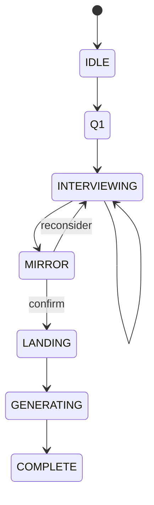

# OSeria Architect — 可执行 UI/UX 规格书

> 日期：2026-03-11  
> 版本：v3.6  
> 性质：实时 UX 规格 + 当前实现对账文档  
> 设计体系：水墨留白（Ink & Void）

## 0. 阅读规则

本文件继续承担实时设计路径图职责，因此允许存在“目标设计”。  
但后文必须严格区分三种状态：

- `当前实现`：代码中已经存在
- `目标设计`：产品/UX 方向已确定，但代码未完全追上
- `暂不实现`：本阶段不进入主线

特别说明：

- 文中的“蓝图结果层”是产品概念层
- 当前代码里没有独立的 `BlueprintView` 组件
- 当前结果页由 `CompleteView` 承载，完整 Prompt 查看器为 `PromptInspector`

## 0.1 当前实现检查点

截至 2026-03-11，当前代码已具备：

- 单页应用访谈流
- `q1 / interviewing / mirror / landing / generating / complete` 前端状态
- `mirror_action` 结构化动作接线
- 蓝图结果层 + 完整 Prompt 查看器
- `retry generate` 与 `restart` 两条恢复路径

当前仍未完全达成的 UX 目标：

- 错误态尚未拆成成功页 / 可重试失败页 / 致命故障页
- 部分错误文案仍直接显示后端 `message`
- 前端没有自动化交互测试

## 1. 产品界面模型

### 1.1 当前实现

产品是单页应用（SPA），无路由跳转。  
访谈阶段使用上下分区布局：

- 上区：当前轮次的造梦者文字
- 下区：泡泡区 + 输入区

全屏阶段有三类：

- `mirror`
- `landing`
- `generating`
- `complete`

### 1.2 目标设计

整体维持“卷轴式、留白式、无历史回看”的沉浸结构，不引入聊天列表，也不把页面做成普通 IM 对话框。

### 1.3 布局骨架

```css
.layout {
  display: flex;
  flex-direction: column;
  height: 100dvh;
  max-width: 680px;
  margin: 0 auto;
  padding: 40px 40px 24px;
  background: #FAFAF7;
}

.upper-zone {
  flex: 1 1 auto;
  display: flex;
  align-items: center;
  justify-content: center;
  overflow: hidden;
}

.lower-zone {
  flex: 0 0 auto;
}
```

## 2. 状态机与前后端分工

### 2.1 后端 phase

后端正式枚举只有 4 个：

- `interviewing`
- `mirror`
- `landing`
- `complete`

### 2.2 前端 phase

前端 `UiPhase` 在后端 phase 基础上扩出：

- `idle`
- `q1`
- `interviewing`
- `mirror`
- `landing`
- `generating`
- `complete`

实施规则：

- `q1` 是前端对“刚开始且 `raw_payload == null` 的 interviewing”做的本地映射
- `generating` 是前端本地等待态，不要求后端返回对应 phase

### 2.3 全局流程



## 3. 各阶段规格

### 3.1 Q1

`当前实现`：

- 上区展示固定开场问题
- 下区展示 3 个教程泡泡
- 输入框 placeholder 为“或者你有不同的想法？”

`目标设计`：

- 保持高留白
- 教程泡泡只做冷启动解释，不应污染用户输入

### 3.2 Interviewing

`当前实现`：

- 页面只显示当前轮次文本
- `raw_payload.suggested_tags` 被渲染为泡泡
- 用户可点击泡泡填入输入框
- 不展示历史消息列表

`目标设计`：

- 继续保持“像被接住，而不是像在填表”
- 动画以淡入淡出为主，不做聊天软件式滚屏

### 3.3 Mirror

`当前实现`：

- 进入全屏视图
- 渲染 Mirror 文本
- 提供两个动作：
  - `推门`
  - `我得再想想`
- 前端发送 `mirror_action: "confirm" | "reconsider"`

`目标设计`：

- Mirror 必须是情绪确认，不是 JSON 字段校对
- 两个动作继续使用泡泡式选择，而不是普通按钮列表

### 3.4 Landing

`当前实现`：

- 进入独立 Landing 视图
- 用户提交一段最终补充回答
- 当前代码没有真正的 Radio 结构化性别表单，仍是文本提交

`目标设计`：

- 视觉上保持极简、降压
- 如果未来做结构化性别选项，也应作为前端展示层增强，而不是先改后端 phase

### 3.5 Generating

`当前实现`：

- 前端本地切换到 `generating`
- 调用 `/api/generate`
- 成功后进入 `complete`

`目标设计`：

- 等待态文案应克制
- 不要显示工程术语或后端内部步骤

### 3.6 Complete

`当前实现`：

- 页面由 `CompleteView` 承载
- 展示内容包括：
  - 世界标题
  - 世界摘要
  - 主角起点
  - 核心张力
  - 基调关键词
  - 核心维度
  - 留白维度
  - 玩家侧写
- 支持：
  - 查看完整 Prompt
  - 复制蓝图摘要
  - 重新生成
  - 再造一个世界
- `PromptInspector` 作为独立覆盖层展示完整 Prompt

`目标设计`：

- 默认首先服务普通用户，因此先展示“蓝图结果层”
- 完整 Prompt 属于二级内容层
- 结果层文案应继续去工程字段化

## 4. 完成态的产品分层

### 4.1 当前实现

当前结果页结构可理解为：

```text
CompleteView
  -> 蓝图结果层（产品概念层）
  -> PromptInspector（二级内容层）
```

### 4.2 目标设计

完成态同时服务两类用户：

- 普通用户：快速理解“这个世界是什么”
- 专业用户：查看完整 Prompt，用于调试或二次创作

分层原则：

1. 第一层永远是蓝图结果层
2. 第二层才是完整 Prompt 查看
3. 不默认把长 Prompt 直接压到结果页主视口

### 4.3 当前与目标的差异

- 当前代码中，蓝图结果层还没有被拆成独立组件
- 这不影响产品分层已经成立
- 后续如果要拆组件，应从 `CompleteView` 内部拆，不必先改后端协议

## 5. 组件映射

### 5.1 当前真实组件

当前代码存在的关键组件：

- `App`
- `CurrentScene`
- `BubbleField`
- `InputArea`
- `TutorialHint`
- `MirrorView`
- `LandingView`
- `GenerationView`
- `CompleteView`
- `PromptInspector`

### 5.2 概念层与组件层的对应

| 产品概念层 | 当前承载组件 | 说明 |
| --- | --- | --- |
| 访谈主视图 | `App` + `CurrentScene` + `BubbleField` + `InputArea` | 当前已落地 |
| Mirror 全屏 | `MirrorView` | 当前已落地 |
| Landing 低压补全 | `LandingView` | 当前已落地 |
| 生成等待层 | `GenerationView` | 当前已落地 |
| 蓝图结果层 | `CompleteView` 内部内容 | 当前不是独立组件 |
| Prompt 检视层 | `PromptInspector` | 当前已落地 |

### 5.3 暂不把目标子组件写成既成事实

以下命名如果未来要拆，可以作为目标设计参考，但当前不应再写成已存在组件：

- `LayoutShell`
- `WaitingOverlay`
- `RotatingCopy`
- `BlueprintHero`
- `BlueprintSections`
- `ResultActions`
- `PromptScrollContainer`

## 6. 核心交互契约

### 6.1 Bubble 交互

`当前实现`：

- Q1 泡泡用于教程提示
- Interviewing 泡泡用于快速填词

`目标设计`：

- 教程泡泡与建议泡泡共用视觉体系
- 但语义必须分开，不要让教程泡泡自动提交内容

### 6.2 输入区契约

`当前实现`：

- 支持文本输入
- 提交后进入等待态
- 长文本 placeholder 会变化

`目标设计`：

- Enter 提交与 IME 兼容
- Shift+Enter 保留换行能力
- 等待态应明确禁用输入

### 6.3 PromptInspector 契约

`当前实现`：

- 覆盖层展示完整 Prompt
- 支持关闭
- 支持复制 Prompt
- 支持 `Esc` 关闭

`目标设计`：

- 继续保持独立滚动容器
- 不让结果主页面进入长滚动模式

## 7. API 对 UX 的约束

### 7.1 当前正式协议

- `/api/interview/start`：返回 `session_id + phase + message`
- `/api/interview/message`：返回 `phase + message + raw_payload + artifacts`
- `/api/generate`：返回 `blueprint + system_prompt`

### 7.2 当前 UX 依赖的关键字段

- `raw_payload.suggested_tags`
- `raw_payload.routing_snapshot`
- `artifacts`
- `blueprint`
- `system_prompt`

### 7.3 当前错误语义边界

`当前实现`：

- 前端会收到 `code / message / retryable`
- `retryable=true` 时可以走重试生成路径

`目标设计`：

- `session_expired`：引导重新开始
- `generate_failed`：保留“重新生成”
- 致命错误：进入独立故障态，而不是继续复用成功页布局

## 8. 当前偏差清单

1. Landing 仍是文本提交，不是结构化表单
2. 错误态仍在 `CompleteView` 内承载
3. 蓝图结果层尚未拆出独立组件
4. 部分产品文案仍偏工程调试口径
5. 前端缺少自动化交互测试

这些偏差都是“代码尚未追上设计”，不是“设计已经被废弃”。

## 9. 下一阶段 UX 路线

建议顺序：

1. 先拆错误态分层
2. 再收口结果页文案与蓝图结果层结构
3. 再考虑是否把 Landing 做成更结构化输入
4. 最后再做更细的动效增强

原因：

- 当前最大风险不是“界面不够华丽”
- 而是成功态、失败态、恢复路径的语义边界还不够清楚

## 10. 结论

这份文档继续是实时 UX 路径图，但从现在开始必须遵守一个底线：

`目标设计可以前瞻，当前实现不能造假。`

截至 2026-03-11，前端已经具备一条可跑通的 Architect 体验链路；  
接下来要做的不是重讲愿景，而是持续把结果态、错误态和组件边界收口。
