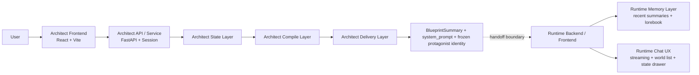

# OSeria 项目技术说明（总览版）

> 版本：v0.2  
> 日期：2026-03-14  
> 用途：团队内部对账文档、跨模块技术总览、Architect/Runtime 边界说明  
> 方法：代码优先；当 spec、日志与实现冲突时，以当前仓库代码为准，并及时回写文档

## 1. 文档定位

本文档描述的是 OSeria 的当前正式技术架构、设计动机、实现方案、实现边界与预期效果。

它不是开发过程记录，也不是路线图。  
过程性决策、分歧和线程复盘，统一下沉到：

- `Architect/docs/implementation_plan.md`
- `Architect/docs/logs/架构Log.md`
- `Runtime/docs/implementation_plan.md`
- `Runtime/docs/logs/架构log.md`

OSeria 是一个两段式系统：

1. `Architect`
   负责访谈、状态收束、世界编译和交付物生成。
2. `Runtime`
   负责承接 `system_prompt` 进入持续互动叙事，并通过短期记忆与 Lorebook 自生成让世界在游玩中继续生长。

截至 2026-03-14，这两段系统都已经在仓库中有独立实现，但成熟度不同：

- `Architect`：世界编译主链已完整落地，并持续推进编译层升级
- `Runtime`：已形成可玩的 vNext 原型，但仍在长线稳定性与记忆检索层持续收口

## 2. OSeria 当前正式架构

其中，`Architect` 的正式功能架构已经收口为三层：

1. `State Layer`
   负责访谈状态、用户理解和世界理解的持续收束。
2. `Compile Layer`
   负责把稳定语义摘要编译为下游可消费的模块化规则系统。
3. `Delivery Layer`
   负责把编译结果交付为面向人读的 `blueprint` 与面向 Runtime 的 `system_prompt`。

当前代码中完整跑通的主链路是：

`Interviewer -> Conductor -> Forge -> Assembler -> ResultPackager`

这条链路已经证明 `Architect` 不是一段一次性 Prompt，而是一条可运行的世界编译链。  
同时，三层正式架构中的部分对象和接口已经拍板，但尚未全部接入当前运行主链路；这一点会在第 5 节明确写出。

## 3. Architect：为什么采用这种设计

`Architect` 的分层不是为了把模块名写得更漂亮，而是为了解决当前系统已经暴露出的四类工程问题。

### 3.1 避免“理解用户”与“编译规则”混成一层

如果访谈过程、语义收束、模块路由和最终拼装都在一个单体流程里完成，系统会不断重新解释用户，最终让：

- 访谈阶段和生成阶段各自保留一套理解
- 同一语义被重复命名、重复总结、重复漂移
- `/generate` 变成一次新的“再理解用户”

因此正式架构强制把：

- 长期状态
- 编译摘要
- 下游交付

拆开处理。

### 3.2 避免下游世界化深度分配失衡

当前主链路已经能根据维度 pack 生成世界规则，但问题也很明确：

- 少数 forged section 很像这次用户的世界
- 部分 `meta / eng` 模块仍保留较强模板口吻
- 如果继续只靠“命中 pack 就 forge”这一种开关，后续只会放大拼装感和 section 粘连

因此正式架构把下游目标定义为“模块分层世界化”：

- 不是所有模块都 full forge
- 而是整份 `system_prompt` 都参与世界化，只是深度不同

### 3.3 避免 Assembler 退化为补锅层

如果模块策略不清、上下文冻结不清、输入边界不清，最后所有脏活都会堆到 `Assembler`：

- 去重
- 修补语气
- 掩盖模板残渣
- 替别人做二次创作

这会让编译链越来越不可控。  
因此 `Assembler` 的正式定位被固定为轻编译器，而不是重型补锅层。

## 4. Architect：具体技术实现方案

### 4.1 State Layer

正式对象边界如下：

- `routing_snapshot`
- `world_dossier`
- `player_dossier`

它们的职责分别是：

- `routing_snapshot`：访谈流程控制、维度覆盖和阶段判断
- `world_dossier`：系统对用户想进入什么世界的持续理解
- `player_dossier`：系统对用户偏好、语言气质和禁区的持续理解

当前实现中的落地点主要在访谈运行时：

- 对应文件：
  - `interviewer.py`
  - `interview_controller.py`
  - `dimension_registry.py`
  - `bubble_suggester.py`
  - `data/interview_dimensions.json`
  - `prompts/interviewer_system_prompt.md`
- 当前职责：
  - 固定开场问题
  - 维护 `interviewing / mirror / landing / complete` 四态
  - 加载显式维度 registry
  - 将维度菜单注入访谈 prompt
  - 生成问题文本与系统 JSON
  - 解析并维护 `routing_snapshot`
  - 通过 `BubbleSuggester` 生成 deterministic 泡泡
  - 在模型格式失真时执行 repair pass

当前访谈状态机的代码事实：

- 后端 phase 只有 4 个：`interviewing / mirror / landing / complete`
- `Mirror` 触发由代码控制，不由模型自行拍板
- 触发条件为：
  - `untouched <= 2`
  - 或 `turn >= 6`

### 4.2 Compile Layer

正式对象边界如下：

- `CompileOutput`
- `FrozenCompilePackage`

正式模块边界如下：

- `Conductor`
- `Forge`
- `Assembler`

这层的正式职责是：  
先把访谈结果收束为唯一编译语义摘要，再把冻结后的编译输入交给下游模块编译，不允许在生成时回读 live state。

#### Conductor

对应文件：

- `conductor.py`
- `data/dimension_map.json`

当前实现职责：

- 接收访谈产物
- 将 `confirmed_dimensions` 映射到 Pack
- 处理 `requires` 和 `also_consider`
- 保留未知维度任务
- 输出 `ForgeManifest`

正式定位：

- `Conductor` 是代码路由层，不是二次 LLM 指挥层
- 它负责决定哪些模块执行、以什么模式执行
- 它不负责重新理解用户

#### Forge

对应文件：

- `forge.py`
- `prompts/subagent_system_prompt.md`

当前实现职责：

- 为每个维度任务渲染子代理 prompt
- 使用 `asyncio.gather()` 并发生成规则片段
- 为无模板维度提供 fallback 生成路径
- 输出 `dict[dimension, forged_rule_text]`

正式定位：

- `Forge` 负责模块级世界化
- 它不是“凡是下游内容都重写一遍”的总生成器

根据最新实施计划，Compile Layer 的正式世界化策略已经固定为四档：

1. `Hard Lock`
2. `Parameterized`
3. `Soft-Forged`
4. `Full-Forged`

这表示下游模块会按深度参与世界化，而不是只有“进 forge / 不进 forge”两态。

#### Assembler

对应文件：

- `assembler.py`
- `data/core/*.json`

当前实现职责：

- 固定加载 Core 模块
- 从 `narrative_briefing + player_profile` 提取 8 个 Core 变量
- 替换 Core 模板占位符
- 按固定章节顺序拼装最终 `system_prompt`

当前实现中的最终 Prompt 结构为 7 段：

- `I. System Role`
- `II. Experience Standard`
- `III. Immutable Constitution`
- `IV. Engine Protocols`
- `V. World-Specific Rules`
- `VI. Emergent Dimensions`
- `VII. Player Calibration`

正式定位：

- `Assembler` 只负责轻编译
- 它负责固定顺序、标题归一、轻量清洗、轻量去噪
- 它不负责替代模块策略设计，也不应承担重型二次创作

### 4.3 Delivery Layer

对应文件：

- `result_packager.py`

当前职责：

- 把编译结果转成前端结果页可读对象
- 输出 `BlueprintSummary`
- 同时返回最终 `system_prompt`

这里必须区分两种交付物：

- `blueprint`：产品展示层摘要，面向人读
- `system_prompt`：Runtime handoff 边界，面向下游运行时

`BlueprintSummary` 当前是轻摘要，不是第二次完整造世界。

### 4.4 API 与前后端契约

对应文件：

- `api.py`
- `api_models.py`
- `service.py`

当前已落地端点：

- `POST /api/interview/start`
- `POST /api/interview/message`
- `POST /api/generate`
- `GET /api/health`

当前关键契约：

- `/api/interview/start`
  - 返回 `session_id`
  - 返回 `phase = interviewing`
  - 返回固定开场问题
- `/api/interview/message`
  - 支持普通 `message`
  - 支持结构化 `mirror_action: "confirm" | "reconsider"`
- `/api/generate`
  - 以 session 内已有访谈产物为主输入
  - 当前返回 `blueprint + system_prompt`

当前前后端 phase 边界需要明确区分：

- 后端 `BackendPhase`：`interviewing / mirror / landing / complete`
- 前端 `UiPhase`：`idle / q1 / interviewing / mirror / landing / generating / complete`

其中：

- `q1` 是前端对启动态的本地映射
- `generating` 是前端等待态，不是后端 phase

当前错误契约边界：

- `ArchitectServiceError` 已统一包装为 `ErrorResponse`
- FastAPI 422 validation error 已统一包装
- 错误体包含 `code / message / retryable`

### 4.5 前端结果层与验证基线

前端位于 `Architect/frontend/`，技术栈为 `React 18 + TypeScript + Vite`。

当前真实组件边界：

- `CompleteView`
- `CompleteSuccessView`
- `GenerateFailureView`
- `FatalErrorView`
- `PromptInspector`

需要明确：

- 当前不存在 `BlueprintView`
- 蓝图展示由 `CompleteView` 承载
- 完整 Prompt 查看器是 `PromptInspector`

截至 2026-03-14，Architect 主链持续有自动化测试和前端构建验证，但测试数量不再在总览文档里冻结。  
准确结果以模块测试输出和对应架构 log 为准。

## 5. Architect：当前实现边界

正式架构已经拍板，不等于所有对象都已落地。当前边界必须明确区分。

| 范围 | 状态 | 当前事实 |
| --- | --- | --- |
| `Interviewer -> Conductor -> Forge -> Assembler -> ResultPackager` 主链路 | 已实现 | 可运行、可测试、可演示 |
| 显式维度 registry | 已实现 | `dimension_registry.py` + `data/interview_dimensions.json` 已接线 |
| deterministic 泡泡生成 | 已实现 | `BubbleSuggester` 已替代直接信任模型标签 |
| repair pass | 已实现 | 访谈解析失败时可内部回补 |
| `BlueprintSummary + system_prompt` 交付 | 已实现 | `/api/generate` 可返回最终结果 |
| `routing_snapshot` | 已实现 | 当前唯一长期存在的访谈状态账本 |
| `world_dossier / player_dossier` | 部分实现 | 术语、prompt 和结构方向已定，尚未进入主链路 session |
| `CompileOutput` | 部分实现 | 正式语义边界已定，当前运行中仍以 `InterviewArtifacts` 为中间输入 |
| `FrozenCompilePackage` | 未实现 | 当前下游尚未以冻结包为唯一输入 |
| `Conductor` 模块执行计划 | 未实现 | 当前仍输出 `ForgeManifest`，不是更通用的 module execution plan |
| `Forge` 多模式执行器 | 未实现 | 当前仍是维度 pack 并发生成，不区分四档执行模式 |
| `Assembler` 轻编译清洗增强 | 部分实现 | 固定顺序与模板替换已落地，更系统的清洗/去噪仍未完成 |
| Session 持久化 | 未实现 | 当前仍为 `InMemorySessionStore` |

对 Architect 当前状态的准确表述应是：

- 正式功能架构已经收口为 `State Layer -> Compile Layer -> Delivery Layer`
- 当前代码完整实现的是这套架构的可运行基线
- 三层中若干关键对象与接口已经定名，但尚未全部进入运行主链路

## 6. Runtime：当前正式状态

`Runtime/` 现已作为顶层独立模块存在，不再只是后半段职责描述。

其正式定位是：

- 一个以世界观卡为中心的互动叙事运行器
- 它承接 Architect 已冻结的世界 authority
- 它不是角色卡中心工作台，也不是另一个 SillyTavern
- 它借鉴 SillyTavern 的流式、Lore 注入、递归激活、上下文预算与非阻塞记忆更新范式，但不继承其高自定义产品形态

### 6.1 当前已落地能力

当前可确认已经实现并跑通的内容包括：

- Architect 正常 complete -> Runtime handoff
- Architect replay complete -> Runtime handoff
- Runtime `create_session -> bootstrap -> turn loop`
- 主角基础身份冻结接入：
  - `protagonist_name`
  - `protagonist_gender`
  - `protagonist_identity_brief`
- Runtime 前端：
  - 世界列表
  - 状态抽屉
  - 短期记忆查看
  - Lorebook 查看
- DeepSeek 主回复 streaming
- 短期记忆：
  - 每轮 `turn_summary`
  - 进入后续主回复上下文
- Lorebook：
  - 每 `5` 轮异步触发
  - 不再阻塞主回复
  - 已升级为 transcript + summaries 的两阶段候选提取与 merge
- Stage routing：
  - `L0` 作为子舞台路由层
  - `L1/L2` 作为阶段内条目层
  - 条件性递归激活

### 6.2 当前 Runtime 边界

从当前代码可确认的 handoff 不再只有 `blueprint + system_prompt`，还包括冻结后的主角基础身份：

- `GenerateResponse.blueprint`
- `GenerateResponse.system_prompt`
- `protagonist_name`
- `protagonist_gender`
- `protagonist_identity_brief`

其中：

- `blueprint` 面向人读
- `system_prompt` 是 Runtime 的唯一世界 authority
- 主角基础身份由 Architect 冻结后 handoff，Runtime 不得覆盖

### 6.3 当前 Runtime 的真实限制

Runtime 已经是可玩的原型，但仍存在明确限制：

- 长回合平均时延仍偏高
- lorebook async 在真实长链中仍暴露出 worker 长时间 `running` 的问题
- stage routing 在真实 20 轮测试中尚未证明稳定生效
- 15+ 回合后仍可能出现 scene lock / repeated prose
- lorebook 队列仍是单进程内存任务，进程重启时允许丢失未完成任务

因此，对 Runtime 当前状态的准确表述应是：

- Runtime 已落地，不再是“未实现”
- Runtime 已具备可玩的 vNext 原型能力
- Runtime 尚未达到长期稳定、可放心连续游玩 20 轮以上的完成度

## 7. 预期效果

按当前正式架构推进，OSeria 的整体预期不是“更复杂”，而是“更稳定、更可控、更容易交接”：

1. 访谈理解、编译摘要和下游交付不再互相重影
2. `system_prompt` 的世界化不再集中在少数 section，而是整体一致、深度分层
3. `Assembler` 保持轻编译器定位，编译链更容易维护和扩展
4. `Architect -> Runtime` 的交接边界已经成形，并持续变得更稳定
5. Runtime 将不再围绕角色卡工作台扩展，而是围绕世界观卡运行与世界生长机制继续演进

截至 2026-03-14，被代码和真实链路共同证明成立的结论是：

- `Architect` 已经是一条可运行、可测试、可演示的世界编译链
- `Runtime` 已经是一套可玩的 vNext 原型
- OSeria 当前正式路线是：
  - `Architect-driven world authority`
  - `world-card-centered narrative runtime`
  - `ST-inspired runtime patterns`
