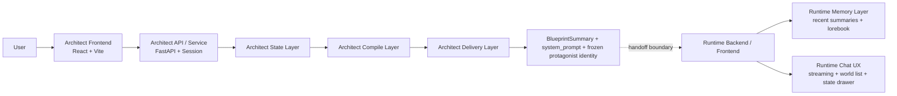

  <h1>OSeria</h1>
  
<strong>A Dual-Core Interactive Narrative Engine</strong>

  
  
  
  

---

## ⬡ The Vision
OSeria is not a character-card workbench. It is a **world-card-centered interactive narrative system**. Built upon the cognitive frameworks of *First Principles*, *The Triad Balance*, and *Occam's Razor*, OSeria bridges abstract architectural visions with a flawless, production-ready generative system.

## ⬡ The Dual-Core Architecture

OSeria separates the cognitive load of World Discovery (0 to 1) from World Delivery (1 to 100). The ecosystem is split into two distinct, sibling modules:

### 1. [The Architect](./Architect/)
The world compiler module. It handles socratic interviews, semantic state convergence, compile-layer routing, and frozen Runtime handoffs. Architect transforms vague user intent into a mathematically robust, structurally sound narrative environment.

### 2. [The Runtime](./Runtime/)
The immersive narrative engine. It consumes the Architect's pre-compiled `blueprint`, `system_prompt`, and frozen protagonist constraints, allowing the world to recursively grow during gameplay through short-term summaries and asynchronous `Lorebook` injection logic.

## ⬡ Core Philosophies
- **First Principles**: Pruning entropy. Decoupling understanding from generation.
- **The Triad Balance**: Technical Feasibility, UX Desirability, and Viability.
- **Occam's Razor**: The simplest robust architecture wins. Document drift is an anti-pattern; code is the ultimate source of truth.

## ⬡ Technical Documentation
If you are diving deep into the system, start here:
- **[OSeria Technical Overview](./OSeria_technical_overview.md)**: The definitive boundary documentation between Architect and Runtime.
- **[Architect Implementation Plan](./Architect/docs/implementation_plan.md)**
- **[Runtime Implementation Plan](./Runtime/docs/implementation_plan.md)**

## ⬡ Media & Demos
*(Videos hosted externally due to LFS limits)*
- [OSeria End-to-End Demo] <!-- Add Bilibili/YouTube link here -->
- [Architect Interface Walkthrough] <!-- Add Bilibili/YouTube link here -->

---

  <i>"True architectural elegance requires aggressively pruning the scaffolding once the bridge is built."</i>
   
  <b>— Strategic Architect</b>

